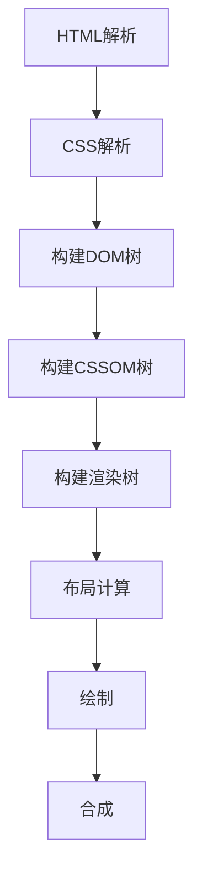
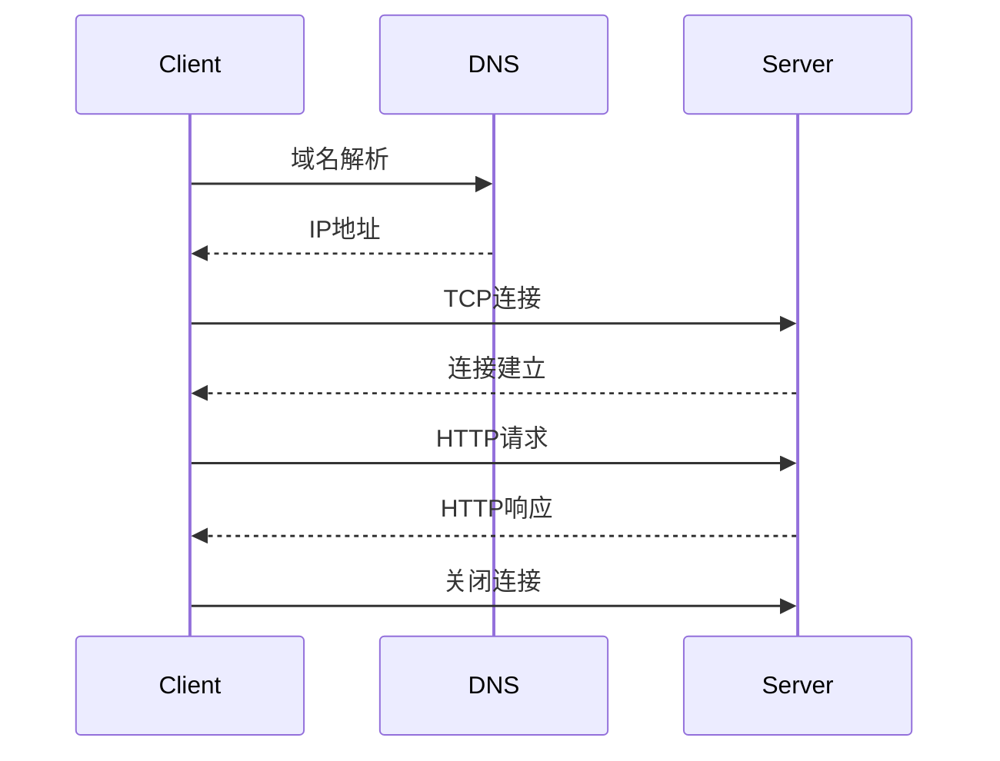
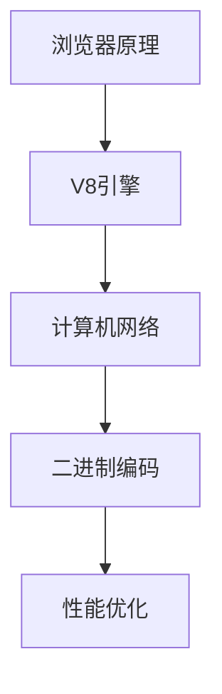

# 计算机基础

## 概述

计算机基础是前端开发的底层支撑，理解这些基础知识有助于我们写出更好的代码，解决更深层的问题。本模块将学习浏览器原理、V8引擎、计算机网络等核心知识。

## 学习内容

### 浏览器原理
- **渲染引擎** - HTML、CSS、JavaScript的解析和渲染
- **事件循环** - 宏任务、微任务、任务队列
- **存储机制** - Cookie、LocalStorage、SessionStorage
- **网络请求** - HTTP协议、缓存策略
- **安全机制** - 同源策略、CORS、XSS、CSRF

### V8引擎
- **JavaScript引擎** - 代码执行流程
- **内存管理** - 垃圾回收、内存泄漏
- **性能优化** - 编译优化、内联缓存
- **调试工具** - Chrome DevTools、性能分析

### 计算机网络
- **应用层** - HTTP、HTTPS、WebSocket
- **传输层** - TCP、UDP协议
- **网络层** - IP协议、路由
- **数据链路层** - 以太网、WiFi
- **物理层** - 信号传输

### 二进制与编码
- **进制转换** - 二进制、八进制、十六进制
- **字符编码** - ASCII、Unicode、UTF-8
- **数据表示** - 整数、浮点数、位运算
- **文件格式** - 图片、音频、视频编码

## 核心概念

### 浏览器渲染流程


### 事件循环机制
```javascript
// 事件循环示例
console.log('1'); // 同步任务

setTimeout(() => {
  console.log('2'); // 宏任务
}, 0);

Promise.resolve().then(() => {
  console.log('3'); // 微任务
});

console.log('4'); // 同步任务

// 输出顺序: 1, 4, 3, 2
```

### HTTP请求流程


## 学习路径



## 实践项目

### 性能监控示例
```javascript
// 性能监控
const observer = new PerformanceObserver((list) => {
  for (const entry of list.getEntries()) {
    console.log(`${entry.name}: ${entry.duration}ms`);
  }
});

observer.observe({ entryTypes: ['navigation', 'resource'] });

// 内存使用监控
setInterval(() => {
  const memory = performance.memory;
  console.log(`内存使用: ${memory.usedJSHeapSize / 1024 / 1024}MB`);
}, 5000);
```

### 网络请求优化
```javascript
// 请求缓存
const cache = new Map();

async function fetchWithCache(url) {
  if (cache.has(url)) {
    return cache.get(url);
  }
  
  const response = await fetch(url);
  const data = await response.json();
  cache.set(url, data);
  
  return data;
}
```

## 学习目标

- 理解浏览器的工作原理
- 掌握V8引擎的执行机制
- 了解计算机网络的基础知识
- 能够进行性能优化和调试
- 理解底层技术对前端开发的影响

## 相关资源

- [Chrome DevTools](https://developers.google.com/web/tools/chrome-devtools)
- [V8引擎文档](https://v8.dev/)
- [MDN Web Docs](https://developer.mozilla.org/)
- [HTTP协议详解](https://tools.ietf.org/html/rfc2616)
- [Web性能优化](https://web.dev/performance/) 