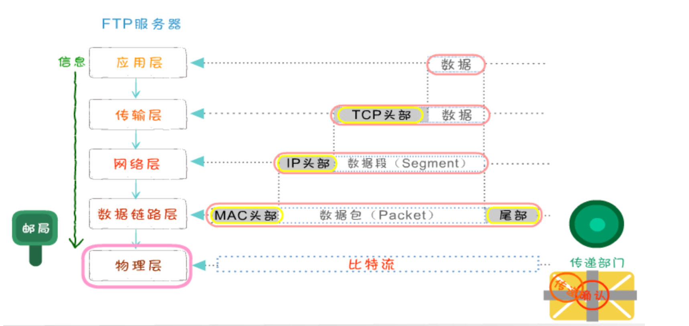
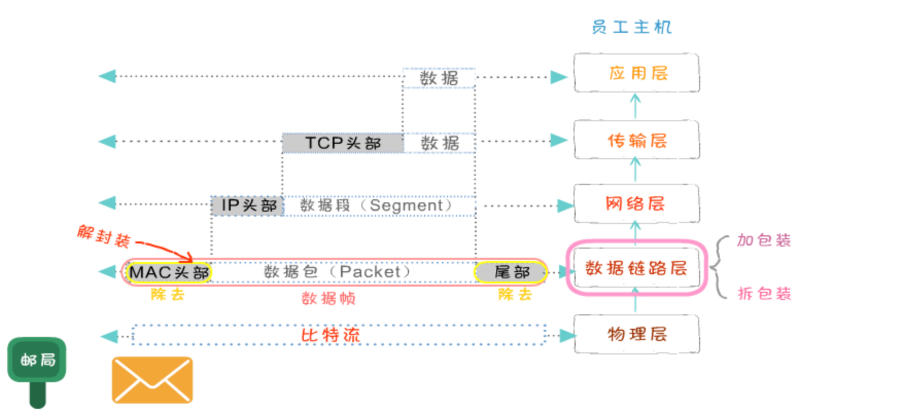
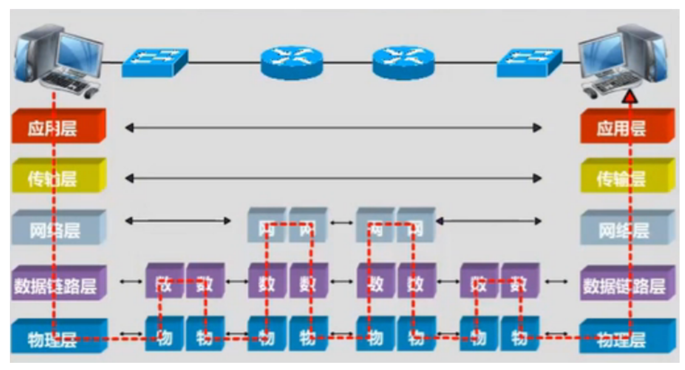

# 计算机网络分层

## 概述

计算机网络采用分层架构设计，将复杂的网络通信问题分解为多个相对简单的层次。每一层都有明确的功能和职责，通过层与层之间的接口进行交互。

## 五层网络架构

### 1. 应用层（Application Layer）

#### 主要功能

- **为用户提供服务**：网页浏览、邮件收发、文件传输
- **应用协议定义**：定义应用程序之间的通信规则
- **数据表示**：处理数据的格式化和编码

#### 核心协议

- **HTTP/HTTPS**：超文本传输协议，用于 Web 浏览
- **FTP**：文件传输协议
- **SMTP/POP3/IMAP**：邮件传输协议
- **DNS**：域名解析协议
- **DHCP**：动态主机配置协议
- **SSH**：安全外壳协议

#### 数据格式

- **消息（Message）**：应用层的数据单元
- **格式**：根据具体协议定义，如 HTTP 请求/响应、DNS 查询等

#### 前端面试重点

- HTTP 协议版本演进（1.0→1.1→2.0→3.0）
- 缓存机制（强制缓存、协商缓存）
- HTTPS 安全传输原理
- 跨域问题及解决方案

---

### 2. 传输层（Transport Layer）

#### 主要功能

- **端到端通信**：提供进程间的可靠通信
- **流量控制**：防止发送方发送过快
- **拥塞控制**：防止网络过载
- **错误检测**：检测传输过程中的错误

#### 核心协议

- **TCP**：传输控制协议，面向连接、可靠传输
- **UDP**：用户数据报协议，无连接、不可靠传输

#### 数据格式

- **TCP 段（Segment）**：TCP 协议的数据单元
- **UDP 数据报（Datagram）**：UDP 协议的数据单元

#### TCP 头部结构

- **源端口/目标端口**：16 位，标识应用进程
- **序列号**：32 位，数据字节的序号
- **确认号**：32 位，期望收到的下一个字节序号
- **头部长度**：4 位，以 4 字节为单位
- **标志位**：6 位，控制连接状态
- **窗口大小**：16 位，接收窗口大小
- **校验和**：16 位，校验数据完整性

#### 前端面试重点

- TCP 三次握手、四次挥手
- TCP 可靠传输机制
- TCP 流量控制和拥塞控制
- UDP vs TCP 选择场景

---

### 3. 网络层（Network Layer）

#### 主要功能

- **路由选择**：确定数据包的最佳传输路径
- **逻辑寻址**：使用 IP 地址进行网络寻址
- **分片重组**：处理不同网络的 MTU 差异
- **跨网段通信**：实现不同网络间的数据交换

#### 核心协议

- **IP**：网际协议，提供无连接的数据包传输
- **ICMP**：互联网控制消息协议，用于网络诊断
- **ARP**：地址解析协议，IP 地址到 MAC 地址的映射

#### 数据格式

- **数据包（Packet）**：网络层的数据单元
- **IP 数据报**：IP 协议的数据单元

#### IP 头部结构

- **版本号**：4 位，IP 版本（IPv4=4，IPv6=6）
- **头部长度**：4 位，以 4 字节为单位
- **服务类型**：8 位，优先级和服务质量
- **总长度**：16 位，整个 IP 数据包长度
- **标识**：16 位，用于分片重组
- **标志**：3 位，控制分片行为
- **片偏移**：13 位，分片在原始包中的位置
- **生存时间**：8 位，TTL，防止无限循环
- **协议**：8 位，上层协议（TCP=6，UDP=17）
- **源 IP 地址**：32 位
- **目标 IP 地址**：32 位

#### 前端面试重点

- IP 地址分类和子网划分
- 路由选择算法
- MTU 和分片重组
- 网络层安全（IP 欺骗、分片攻击）

---

### 4. 数据链路层（Data Link Layer）

#### 主要功能

- **帧封装/解封装**：将网络层数据包封装成帧
- **物理寻址**：使用 MAC 地址进行设备寻址
- **差错检测**：检测传输过程中的比特错误
- **流量控制**：控制帧的发送速率

#### 核心协议

- **以太网协议**：局域网的主要协议
- **PPP**：点对点协议
- **HDLC**：高级数据链路控制协议

#### 数据格式

- **帧（Frame）**：数据链路层的数据单元

#### 以太网帧结构

- **前导码**：7 字节，时钟同步
- **帧起始定界符**：1 字节，帧开始标记
- **目标 MAC 地址**：6 字节
- **源 MAC 地址**：6 字节
- **类型/长度**：2 字节，上层协议类型
- **数据**：46-1500 字节，上层数据
- **帧校验序列**：4 字节，CRC 校验

#### 前端面试重点

- MAC 地址和 IP 地址的区别
- 交换机工作原理
- VLAN 技术
- 网络地址转换（NAT）

---

### 5. 物理层（Physical Layer）

#### 主要功能

- **比特流传输**：在物理媒介上传输比特流
- **信号编码**：将比特转换为电信号或光信号
- **接口标准**：定义物理连接接口规范
- **传输介质**：电缆、光纤、无线等

#### 核心协议

- **以太网物理层**：10/100/1000Mbps 以太网
- **WiFi 物理层**：IEEE 802.11 系列
- **光纤通道**：FC 协议

#### 数据格式

- **比特流（Bit Stream）**：物理层的数据单元
- **信号**：电信号、光信号、无线信号

#### 信号编码技术

- **NRZ 编码**：非归零编码
- **曼彻斯特编码**：解决时钟同步问题
- **差分曼彻斯特编码**：改进的曼彻斯特编码

#### 前端面试重点

- 带宽和传输速率
- 信号编码原理
- 传输介质特性
- 物理层故障排查

---

## 数据封装过程

### 发送端封装

1. **应用层**：生成应用数据
2. **传输层**：添加 TCP/UDP 头部，形成段/数据报
3. **网络层**：添加 IP 头部，形成数据包
4. **数据链路层**：添加帧头部和尾部，形成帧
5. **物理层**：转换为比特流，通过物理媒介传输

- **在应用层**，要把各式各样的数据如字母、数字、汉字、图片等转换成二进制
- **在 TCP 传输层中**，上层的数据被分割成小的数据段，并为每个分段后的数据封装 TCP 报文头部
  - 在 TCP 头部有一个关键的字段信息端口号，它用于标识上层的协议或应用程序，确保上层数据的正常通信
  - 计算机可以多进程并发运行，例如在发邮件的同时也可以通过浏览器浏览网页，这两种应用通过端口号进行区分
- **在网络层**，上层数据被封装上亲的报文头部(IP 头部)，上层的数据是包括 TCP 头部的。IP 地址包括的最关键字段信息就是 IP 地址，用于标识网络的逻辑地址。
- **数据链路径层**，上层数据成一个 MAC 头部，内部有最关键的是 MAC 地址。MAC 地址就是固化在硬件设备内部的全球唯一的物理地址。
- **在物理层**，无论在之前哪一层封装的报文头和还是上层数据都是由二进制组成的，物理将这些二进制数字比特流转换成电信号在网络中传输

### 接收端解封装

1. **物理层**：接收比特流
2. **数据链路层**：解析帧，提取数据包
3. **网络层**：解析 IP 头部，提取段/数据报
4. **传输层**：解析 TCP/UDP 头部，提取应用数据
5. **应用层**：处理应用数据

- 数据封装完毕传输到接收方后，将数据要进行解封装
- 在物理层，先把电信号转成二进制数据，并将数据传送至数据链路层
- 在数据链路层，把 MAC 头部拆掉，并将剩余的数据传送至上一层
- 在网络层，数据的 IP 头部被拆掉，并将剩余的数据送至上一层
- 在传输层，把 TCP 头部拆掉，将真实的数据传送至应用层

### 真实网络环境

- 发送方和接收方中间可能会有多个硬件中转设备
- 中间可能会增加交换机和路由器
- 数据在传输过程中不断地进行封装和解封装的过程，每层设备只能处理哪一层的数据
- 交换机属于数据链路层
- 路由器属于网络层
