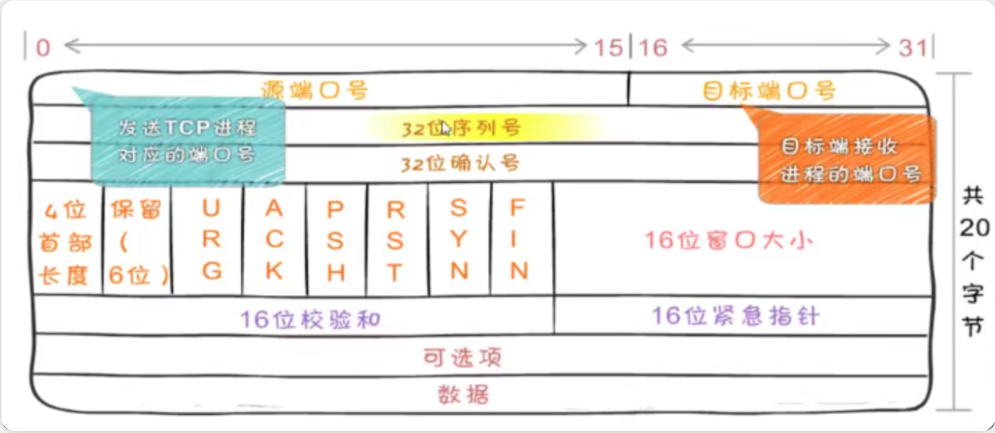

# 运输层

## TCP

- 网络层传输是不可靠的，数据丢失 Ip 层不会校验和处理
- 端到端通信，分段/重组，流量控制，差错校验
- 可靠性：通过确认机制、重传机制、校验和等保证数据不丢失、不重复、不乱序。

- 面向连接：通信前需要先建立连接（三次握手），通信结束后释放连接（四次挥手）。
- 流式传输：将数据视为字节流，不保留消息边界。
- 全双工通信：连接建立后，双方可以同时发送和接收数据。

## 头部

- 端口号最大位 16 个 1，也就是 65535

- 32 位序列号

  - 用序列号对数据包进行标记，以便在到达目的地后重新重装，假设当前的序列号为 s，发送数据长度为 l，则下次发送数据时的序列号为 s + l

- 32 位确认号

  - 下一次应该接收到的数据的序列号。假设发送端的序列号为 s，发送数据的长度为 l，那么接收端返回的确认应答号也是 s + l。发送端接收到这个确认应答后，可以认为这个位置以前所有的数据都已被正常接收

- URG

  - 标识数据段中包含紧急数据，需要优先处理

- ACK

  - 为 1 表示确认号，配和 32 位确认号

- PSH

  - 不等待缓冲区满，立即处理数据

- RST

  - 连接断了重新连接

- SYN

  - 用于建立连接，标识连接请求

- FIN

  - 提出断开连接的一方把 FIN 置为 1 表示要断开连接

- 16 位窗口大小

  - 说明本地可接收数据段的数目，这个值的大小是可变的。当网络通畅时将这个窗口值变大加快传输速度，当网络不稳定时减少这个值可以保证网络数据的可靠传输。它是来在 TCP 传输中进行流量控制的

  - 如果窗口大小为 0，可以发送窗口探测

    - 如果接受方缓存区满了，发送方停止发送，但是每隔一段时间询问是否有空闲可以重新发送了

- 16 位校验和

  - 用来做差错控制，TCP 校验和的计算包括 TCP 首部、数据和其它填充字节。在发送 TCP 数据段时，由发送端计算校验和，当到达目的地时又进行一次检验和计算。如果两次校验 和一致说明数据是正确的，否则 将认为数据被破坏，接收端将丢弃该数据

  - 头部取反

- 16 位紧急指针

      - 作用：指向紧急数据的最后一个字节。

  用途：当 URG 标志位为 1 时，标识紧急数据的位置。

## 三次握手

### 第一次握手

- 客户端发送一个 TSYN 标志位置 1 的包指明客户打算连接的服务器的端口，
  以及初始序号 X,保存在包头的序列号(Sequence Number)字段里
  客户端处于 SYN_Send 状态

### 第二次握手

- 服务器发回确认包(ACK)应答。即 SYN 标志位和 ACK 标志位均为 1 同时
  将确认序号 ack 设置为客户的 I S N 加 1 以.即 X+1，服务器处于 _SYN_REVD_ 的状态

### 第三次握手

- 客户端再次发送确认包(ACK)SYN 标志位为 0,ACK 标志位为 1
  并且把服务器发来 ACK 的序号字段+1,放在确定字段中发送给对方.并且在数据段放写 ISN 的+1，客户端处于 establised 状态。服务器收到 ACK 报文之后，也处于 establised 状态，此时，双方以建立起了链接

### SYN 攻击

- 在短时间内伪造大量不存在的 IP 地址，向服务器不断地发送 syn 包，服务器回复确认包，并等待客户的确认，由于源地址是不存在的，服务器需要不断的重发直 至超时，这些伪造的 SYN 包将长时间占用未连接队列，正常的 SYN 请求被丢弃，目标系统运行缓慢，严重者引起网络堵塞甚至系统瘫痪

## 四次挥手

### 第一次挥手

- 客户端发送 FIN 包，表示"我要关闭连接"。
  客户端状态：ESTABLISHED → FIN_WAIT_1

### 第二次挥手

- 服务器收到 FIN 包后，发送 ACK 包确认。
  服务器状态：ESTABLISHED → CLOSE_WAIT
  客户端状态：FIN_WAIT_1 → FIN_WAIT_2

### 第三次挥手

- 服务器发送 FIN 包，表示"我也要关闭连接"。
  服务器状态：CLOSE_WAIT → LAST_ACK

### 第四次挥手

- 客户端收到 FIN 包后，发送 ACK 包确认。
  客户端状态：FIN_WAIT_2 → TIME_WAIT
  服务器状态：LAST_ACK → CLOSED

- 此时客户端处于 TIME_WAIT 状态。需要过一阵子以确保服务端收到自己的 ACK 报文之后才会进入 CLOSED 状态

- 要确保服务器是否已经收到了我们的 ACK 报文，如果没有收到的话，服务器会重新发 FIN 报文给客户端，客户端再次收到 ACK 报文之后，就知道之前的 ACK 报文丢失了，然后再次发送 ACK 报文。

至于 TIME_WAIT 持续的时间至少是一个报文的来回时间。一般会设置一个计时，如果过了这个计时没有再次收到 FIN 报文，则代表对方成功就是 ACK 报文，此时处于 CLOSED 状态

## 滑动窗口

### TCP 协议中流量控制的核心机制，用于控制发送方的发送速率，防止接收方缓冲区溢出

- 发送方视角

      - 已发送且已确认：数据已成功传输，可以释放缓冲区。

  已发送未确认：数据已发送但等待 ACK 确认。
  可发送：在发送窗口内，可以立即发送的数据。
  不可发送：超出发送窗口，暂时不能发送的数据。

- 接收方视角

      - 已接收：已接收并处理的数据。

  可接收：在接收窗口内，可以接收的数据。
  不可接收：超出接收窗口，暂时不能接收的数据。

- 滑动窗口的优势
  流量控制：防止接收方缓冲区溢出。
  提高效率：允许发送方连续发送多个数据段，无需等待每个 ACK。
  动态调整：根据网络状况和接收方处理能力动态调整窗口大小。

## 拥塞控制

### TCP 协议中防止网络拥塞的机制，通过动态调整发送速率来避免网络过载，确保网络稳定运行

- 开始慢：刚开始发送很少的数据，探测网络状况。 慢启动
  逐渐快：如果网络通畅，逐渐增加发送量。
  发现拥堵：如果发现网络变慢或丢包，立即减少发送量。减少一半 快恢复
  如 3 没收到 456 收到了，请求 3，三次请求会出发快重传 3

## 粘包

### Nagle 算法

- 任意时刻最多只能有一个未被确认的小段（TCP 内部控制）

### coke 算法

- 合并小包统一发送

      - 当数据包达到MSS（Maximum Segment Size）值时统一发送

  MSS 计算：
  合并规则：
  多个小包会合并发送直到达到 MSS 限制
  示例中三个包（"123"）被合并为一个数据单元发送

## TCP 的问题

### 队头阻塞

- 细分主题 1

  - 同一个 TCP 连接里面，所有的数据通信是按次序进行的。服务端是按队列顺序处理请求的，服务器只有处理完一个回应，才会进行下一个回应。假如前面的请求处理时间很长，后面就会有许多请求排队等着，这样就造成了“队头阻塞”的问题

### 慢启动

- 通过快重传，快恢复来解决

### 短链接

- 客户端和服务端进行收发数据的时候才进行连接，一次收发消息后就进行断开

  - TCP 连接的新建成本很高，因为需要客户端和服务器三次握手，并且开始时发送速率较慢（slow start（对应慢启动）

### time-wait

- 不会立即关闭链接，高并发短链接导致大量端口被占用

## UDP 协议

### 无连接、不保证可靠性的传输层协议，也就是说发送端不关心发送的数据是否到达目标主机、数据是否出错等，收到数据的主机也不会告诉 发送方是否收到了数据，它的可靠性由上层协议来保障

首部结构简单，在数据传输时能实现最小的开销，如果进程想发送很短的报文而对可靠性要求不高可以使用

### QQ

视频软件
TFTP 简单文件传输协议(短信)
