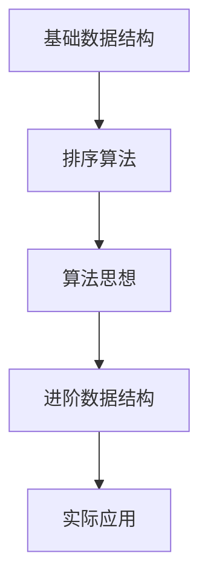

# 数据结构与算法

## 概述

数据结构与算法是计算机科学的基础，也是前端开发中解决复杂问题的核心能力。本模块将系统学习各种数据结构和算法思想。

## 学习内容

### 基础数据结构
- **数组** - 最基础的数据结构
- **栈** - 后进先出(LIFO)的数据结构
- **队列** - 先进先出(FIFO)的数据结构
- **链表** - 动态数据结构
- **哈希表** - 快速查找的数据结构
- **树** - 层次化数据结构
- **堆** - 优先队列的实现
- **图** - 复杂关系的数据结构

### 排序算法
- **冒泡排序** - 最简单的排序算法
- **选择排序** - 选择最小值的排序
- **插入排序** - 插入到有序序列
- **快速排序** - 分治思想的排序
- **希尔排序** - 改进的插入排序

### 算法思想
- **递归** - 函数调用自身
- **双指针** - 数组和链表的常用技巧
- **滑动窗口** - 字符串和数组的优化技巧
- **DFS** - 深度优先搜索
- **BFS** - 广度优先搜索

### 进阶数据结构
- **红黑树** - 自平衡二叉搜索树
- **AVL树** - 高度平衡二叉树
- **B树/B+树** - 数据库索引结构
- **跳表** - 链表的多层索引

## 学习路径

## 实践项目

每个数据结构和算法都配有详细的实现代码和性能分析。

## 相关资源

- [LeetCode](https://leetcode.cn/) - 算法练习平台
- [Visualgo](https://visualgo.net/) - 算法可视化
- [算法导论](https://book.douban.com/subject/20432061/) - 经典教材 