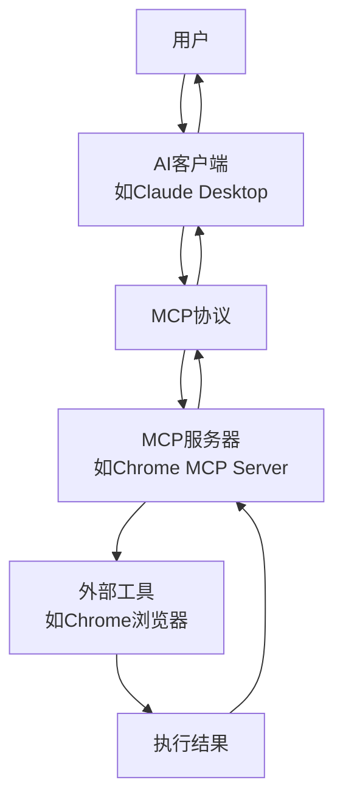

## 🤔 MCP 是什么？

**MCP (Model Context Protocol)** 是一个开放协议标准，用于让 AI 模型与外部工具和服务进行交互。

### 简单理解 MCP

想象一下：

- **AI 模型** = 一个聪明但"手无缚鸡之力"的大脑
- **外部工具** = 各种可以执行具体任务的"手"
- **MCP 协议** = 让大脑和手能够沟通的"语言"

## 🔄 MCP 工作流程



## 📋 具体流程详解

### 1. **用户发起请求**

```
用户: "帮我打开GitHub并搜索React项目"
```

### 2. **AI 客户端接收**

- AI 客户端（如 Claude Desktop）接收到用户请求
- AI 分析需要什么工具来完成任务

### 3. **MCP 协议通信**

```json
// AI通过MCP协议向Chrome MCP Server发送请求
{
  "method": "tools/call",
  "params": {
    "name": "chrome_navigate",
    "arguments": {
      "url": "https://github.com"
    }
  }
}
```

### 4. **MCP 服务器处理**

- Chrome MCP Server 接收到请求
- 调用对应的 Chrome API
- 执行具体的浏览器操作

### 5. **工具执行**

- 实际控制 Chrome 浏览器
- 打开新标签页
- 导航到 GitHub
- 执行搜索操作

### 6. **返回结果**

```json
// 返回执行结果
{
  "result": {
    "content": [
      {
        "type": "text",
        "text": "已成功打开GitHub并搜索React项目"
      }
    ]
  }
}
```

### 7. **AI 响应用户**

```
AI: "我已经帮你打开了GitHub并搜索了React项目，找到了以下结果..."
```

## 🎯 Chrome MCP Server 的特殊价值

### 传统方式 vs MCP 方式

| 传统方式           | MCP 方式          |
| ------------------ | ----------------- |
| 用户手动操作浏览器 | AI 自动控制浏览器 |
| 需要学习各种工具   | 自然语言描述需求  |
| 操作步骤繁琐       | 一键完成复杂任务  |
| 无法跨应用协作     | AI 协调多个工具   |
