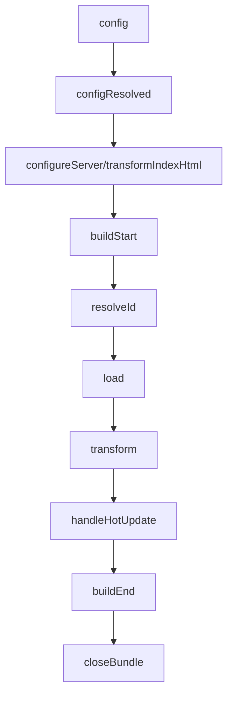

# Vite 插件生命周期钩子完整汇总

## 🎯 插件基础结构

```typescript
interface VitePlugin {
  name: string;                    // 插件名称
  enforce?: 'pre' | 'post';        // 执行顺序
  apply?: 'build' | 'serve' | 'preview'; // 应用场景
  config?: (config: UserConfig, env: ConfigEnv) => UserConfig | null | void | Promise<UserConfig | null | void>;
  configResolved?: (resolvedConfig: ResolvedConfig) => void | Promise<void>;
  configureServer?: (server: ViteDevServer) => (() => void) | void | Promise<(() => void) | void>;
  transformIndexHtml?: {
    order?: 'pre' | 'post';
    handler?: (html: string, ctx: TransformIndexHtmlHookContext) => string | HtmlTagDescriptor[] | void | Promise<string | HtmlTagDescriptor[] | void>;
  } | ((html: string, ctx: TransformIndexHtmlHookContext) => string | HtmlTagDescriptor[] | void | Promise<string | HtmlTagDescriptor[] | void>);
  handleHotUpdate?: (ctx: HmrContext) => Array<ModuleNode> | void | Promise<Array<ModuleNode> | void>;
  resolveId?: (source: string, importer: string | undefined, options: ResolveIdOptions) => string | null | void | Promise<string | null | void>;
  load?: (id: string) => string | null | void | Promise<string | null | void>;
  transform?: (code: string, id: string, options?: TransformOptions) => string | null | void | Promise<string | null | void>;
  buildStart?: (options?: NormalizedInputOptions) => void | Promise<void>;
  buildEnd?: (err?: Error) => void | Promise<void>;
  closeBundle?: () => void | Promise<void>;
}
```

## 📊 生命周期执行顺序



## 🔧 详细钩子解析

### 1. **config** - 配置修改钩子

```typescript
// 在解析 Vite 配置之前调用
const configPlugin = (): Plugin => ({
  name: 'config-plugin',
  config(config, { command, mode }) {
    console.log('配置解析前:', command, mode);
    
    // 修改配置
    return {
      ...config,
      define: {
        ...config.define,
        __APP_VERSION__: JSON.stringify('1.0.0')
      }
    };
  }
});
```

**使用场景**：
- 根据环境变量修改配置
- 注入全局常量
- 动态设置别名

### 2. **configResolved** - 配置解析完成钩子

```typescript
const configResolvedPlugin = (): Plugin => ({
  name: 'config-resolved-plugin',
  configResolved(resolvedConfig) {
    console.log('配置解析完成:', resolvedConfig);
    
    // 保存解析后的配置供其他钩子使用
    this.config = resolvedConfig;
    
    // 根据配置执行不同逻辑
    if (resolvedConfig.mode === 'development') {
      console.log('开发模式配置已加载');
    }
  }
});
```

**使用场景**：
- 配置验证
- 初始化插件状态
- 根据配置设置全局变量

### 3. **configureServer** - 开发服务器配置钩子

```typescript
const serverPlugin = (): Plugin => ({
  name: 'server-plugin',
  configureServer(server) {
    console.log('开发服务器配置中...');
    
    // 添加中间件
    server.middlewares.use('/api', (req, res, next) => {
      console.log('API 请求:', req.url);
      next();
    });
    
    // 监听文件变化
    server.watcher.on('change', (path) => {
      console.log('文件变化:', path);
    });
    
    // 返回清理函数
    return () => {
      console.log('服务器关闭，清理资源');
    };
  }
});
```

**使用场景**：
- 添加自定义中间件
- 文件监听
- 热更新处理
- 代理配置

### 4. **transformIndexHtml** - HTML 转换钩子

```typescript
const htmlPlugin = (): Plugin => ({
  name: 'html-plugin',
  transformIndexHtml: {
    order: 'pre', // 执行顺序
    handler(html, ctx) {
      console.log('转换 HTML:', ctx.filename);
      
      // 注入脚本
      const scriptTag = {
        tag: 'script',
        attrs: { type: 'module' },
        children: 'console.log("注入的脚本");',
        injectTo: 'head'
      };
      
      // 注入样式
      const styleTag = {
        tag: 'link',
        attrs: { rel: 'stylesheet', href: '/custom.css' },
        injectTo: 'head'
      };
      
      return [scriptTag, styleTag];
    }
  }
});
```

**使用场景**：
- 注入全局脚本
- 添加 meta 标签
- 修改 HTML 结构
- 注入样式文件

### 5. **resolveId** - 模块解析钩子

```typescript
const resolvePlugin = (): Plugin => ({
  name: 'resolve-plugin',
  resolveId(source, importer, options) {
    console.log('解析模块:', source, '来自:', importer);
    
    // 自定义模块解析
    if (source.startsWith('virtual:')) {
      return source; // 返回虚拟模块 ID
    }
    
    // 别名解析
    if (source === 'my-utils') {
      return '/src/utils/index.js';
    }
    
    return null; // 继续默认解析
  }
});
```

**使用场景**：
- 虚拟模块创建
- 别名解析
- 外部依赖处理
- 模块重定向

### 6. **load** - 模块加载钩子

```typescript
const loadPlugin = (): Plugin => ({
  name: 'load-plugin',
  load(id) {
    console.log('加载模块:', id);
    
    // 处理虚拟模块
    if (id.startsWith('virtual:')) {
      const moduleName = id.replace('virtual:', '');
      return `
        export const message = "Hello from ${moduleName}";
        export default { message };
      `;
    }
    
    // 处理特定文件类型
    if (id.endsWith('.custom')) {
      return `
        export const data = "Custom file content";
      `;
    }
    
    return null; // 继续默认加载
  }
});
```

**使用场景**：
- 虚拟模块内容生成
- 自定义文件格式处理
- 动态内容生成
- 模板文件处理

### 7. **transform** - 代码转换钩子

```typescript
const transformPlugin = (): Plugin => ({
  name: 'transform-plugin',
  transform(code, id, options) {
    console.log('转换代码:', id);
    
    // 只处理特定文件
    if (!id.includes('.vue') && !id.includes('.js')) {
      return null;
    }
    
    // 代码转换示例
    let transformedCode = code;
    
    // 替换全局变量
    transformedCode = transformedCode.replace(
      /__APP_VERSION__/g,
      JSON.stringify('1.0.0')
    );
    
    // 添加调试信息
    if (this.config?.mode === 'development') {
      transformedCode = `console.log('调试: ${id}');\n${transformedCode}`;
    }
    
    return {
      code: transformedCode,
      map: null // 提供 source map
    };
  }
});
```

**使用场景**：
- 代码转换和编译
- 全局变量替换
- 调试信息注入
- 代码优化

### 8. **handleHotUpdate** - 热更新处理钩子

```typescript
const hmrPlugin = (): Plugin => ({
  name: 'hmr-plugin',
  handleHotUpdate(ctx) {
    console.log('热更新:', ctx.file, ctx.modules);
    
    // 自定义热更新逻辑
    if (ctx.file.includes('.vue')) {
      // 强制刷新特定模块
      return ctx.modules;
    }
    
    // 阻止某些文件的热更新
    if (ctx.file.includes('.config.')) {
      return [];
    }
    
    // 添加自定义模块到热更新列表
    const customModules = ctx.modules.filter(mod => 
      mod.id.includes('custom')
    );
    
    return customModules;
  }
});
```

**使用场景**：
- 自定义热更新逻辑
- 模块依赖关系处理
- 热更新优化
- 特定文件处理

### 9. **buildStart** - 构建开始钩子

```typescript
const buildStartPlugin = (): Plugin => ({
  name: 'build-start-plugin',
  buildStart(options) {
    console.log('构建开始:', options);
    
    // 清理构建缓存
    this.cache = new Map();
    
    // 验证构建配置
    if (!options.input) {
      throw new Error('缺少构建入口文件');
    }
    
    // 初始化构建状态
    this.buildState = {
      startTime: Date.now(),
      fileCount: 0
    };
  }
});
```

**使用场景**：
- 构建前准备
- 缓存清理
- 配置验证
- 状态初始化

### 10. **buildEnd** - 构建结束钩子

```typescript
const buildEndPlugin = (): Plugin => ({
  name: 'build-end-plugin',
  buildEnd(err) {
    if (err) {
      console.error('构建失败:', err);
      return;
    }
    
    console.log('构建完成');
    
    // 输出构建统计
    const duration = Date.now() - this.buildState.startTime;
    console.log(`构建耗时: ${duration}ms`);
    console.log(`处理文件数: ${this.buildState.fileCount}`);
    
    // 清理资源
    this.cache.clear();
  }
});
```

**使用场景**：
- 构建后处理
- 统计信息输出
- 资源清理
- 错误处理

### 11. **closeBundle** - 打包完成钩子

```typescript
const closeBundlePlugin = (): Plugin => ({
  name: 'close-bundle-plugin',
  closeBundle() {
    console.log('打包完成');
    
    // 后处理操作
    this.postProcess();
    
    // 生成构建报告
    this.generateReport();
  },
  
  postProcess() {
    // 文件压缩、优化等
    console.log('执行后处理...');
  },
  
  generateReport() {
    // 生成构建报告
    console.log('生成构建报告...');
  }
});
```

**使用场景**：
- 打包后处理
- 文件优化
- 构建报告生成
- 部署准备

## 🏗️ 企业级插件示例

### 完整的插件开发示例

```typescript
// vite-plugin-custom.ts
import type { Plugin, ResolvedConfig } from 'vite';

interface CustomPluginOptions {
  prefix?: string;
  debug?: boolean;
}

export default function customPlugin(options: CustomPluginOptions = {}): Plugin {
  const { prefix = 'custom', debug = false } = options;
  
  let config: ResolvedConfig;
  
  return {
    name: 'vite-plugin-custom',
    enforce: 'pre', // 优先执行
    
    config(config, { command, mode }) {
      if (debug) {
        console.log(`[${prefix}] 配置阶段:`, { command, mode });
      }
      
      // 注入全局变量
      return {
        define: {
          ...config.define,
          __CUSTOM_PREFIX__: JSON.stringify(prefix),
          __BUILD_TIME__: JSON.stringify(new Date().toISOString())
        }
      };
    },
    
    configResolved(resolvedConfig) {
      config = resolvedConfig;
      if (debug) {
        console.log(`[${prefix}] 配置解析完成`);
      }
    },
    
    configureServer(server) {
      if (debug) {
        console.log(`[${prefix}] 开发服务器配置`);
      }
      
      // 添加自定义中间件
      server.middlewares.use(`/${prefix}`, (req, res) => {
        res.end(`Hello from ${prefix} plugin!`);
      });
    },
    
    transform(code, id) {
      if (!id.includes('.vue') && !id.includes('.js')) {
        return null;
      }
      
      if (debug) {
        console.log(`[${prefix}] 转换文件:`, id);
      }
      
      // 代码转换
      const transformedCode = code.replace(
        /console\.log\(/g,
        `console.log('[${prefix}] ', `
      );
      
      return {
        code: transformedCode,
        map: null
      };
    },
    
    buildStart() {
      if (debug) {
        console.log(`[${prefix}] 构建开始`);
      }
    },
    
    buildEnd(err) {
      if (err) {
        console.error(`[${prefix}] 构建失败:`, err);
      } else {
        console.log(`[${prefix}] 构建完成`);
      }
    },
    
    closeBundle() {
      if (debug) {
        console.log(`[${prefix}] 打包完成`);
      }
    }
  };
}
```

## 📊 钩子执行时机总结

| 钩子 | 执行时机 | 主要用途 | 返回值 |
|------|----------|----------|--------|
| `config` | 配置解析前 | 修改配置 | 配置对象 |
| `configResolved` | 配置解析后 | 保存配置 | void |
| `configureServer` | 开发服务器启动 | 中间件、监听 | 清理函数 |
| `transformIndexHtml` | HTML 处理 | 注入标签 | HTML 或标签数组 |
| `resolveId` | 模块解析 | 自定义解析 | 模块 ID |
| `load` | 模块加载 | 虚拟模块 | 模块内容 |
| `transform` | 代码转换 | 代码处理 | 转换后的代码 |
| `handleHotUpdate` | 热更新 | 自定义 HMR | 模块数组 |
| `buildStart` | 构建开始 | 初始化 | void |
| `buildEnd` | 构建结束 | 清理、统计 | void |
| `closeBundle` | 打包完成 | 后处理 | void |

## 🎯 最佳实践

1. **钩子选择**：根据需求选择合适的钩子
2. **性能考虑**：避免在频繁调用的钩子中执行重操作
3. **错误处理**：在关键钩子中添加错误处理
4. **调试支持**：提供调试选项便于开发
5. **文档完善**：为插件提供详细的使用文档

这套完整的生命周期钩子体系是 Vite 插件开发的核心，掌握它们可以构建出功能强大、性能优异的插件！
