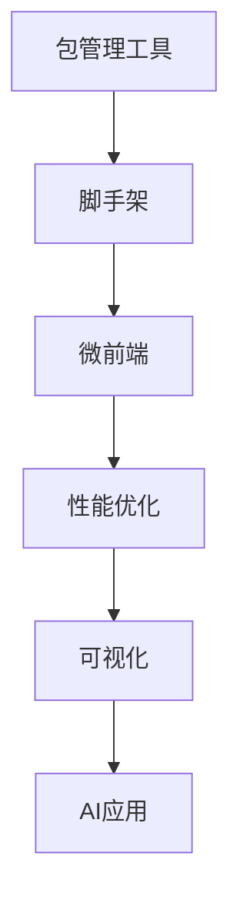

# 工程化

## 概述

前端工程化是现代前端开发的重要组成部分，它涵盖了从项目初始化到部署上线的全流程。本模块将学习包管理、脚手架、微前端、性能优化等工程化实践。

## 学习内容

### 包管理工具
- **npm** - Node.js包管理器
- **yarn** - Facebook开发的包管理器
- **pnpm** - 快速、节省磁盘空间的包管理器
- **包管理原理** - 依赖解析、版本管理、缓存机制

### 脚手架工具
- **Vue CLI** - Vue项目脚手架
- **Create React App** - React项目脚手架
- **Vite** - 现代构建工具脚手架
- **自定义脚手架** - 脚手架开发原理

### 微前端
- **微前端架构** - 大型应用的拆分策略
- **qiankun** - 蚂蚁金服微前端框架
- **single-spa** - 微前端框架
- **模块联邦** - Webpack 5新特性

### 性能优化
- **加载优化** - 代码分割、懒加载、预加载
- **运行时优化** - 内存管理、垃圾回收
- **构建优化** - Tree Shaking、压缩、缓存
- **监控分析** - 性能监控、错误追踪

### 可视化
- **Canvas** - 2D图形绘制
- **WebGL** - 3D图形渲染
- **SVG** - 矢量图形
- **Three.js** - 3D库
- **D3.js** - 数据可视化

### AI应用
- **机器学习** - TensorFlow.js、ONNX.js
- **自然语言处理** - 文本分析、语言模型
- **计算机视觉** - 图像识别、人脸检测
- **智能推荐** - 个性化推荐算法

## 工具对比

| 工具 | 特点 | 适用场景 |
|------|------|----------|
| npm | 官方包管理器、生态最全 | 一般项目 |
| yarn | 速度快、锁定文件 | 大型项目 |
| pnpm | 节省空间、速度快 | 现代项目 |
| Vue CLI | Vue生态、配置丰富 | Vue项目 |
| Vite | 开发速度快、配置简单 | 现代项目 |

## 学习路径



## 实践项目

### 自定义脚手架示例
```javascript
#!/usr/bin/env node

const { program } = require('commander');
const chalk = require('chalk');
const fs = require('fs-extra');
const path = require('path');

program
  .version('1.0.0')
  .command('create <project-name>')
  .description('创建一个新项目')
  .action(async (projectName) => {
    const targetDir = path.join(process.cwd(), projectName);
    
    if (fs.existsSync(targetDir)) {
      console.log(chalk.red(`项目 ${projectName} 已存在`));
      return;
    }
    
    // 创建项目目录
    await fs.mkdir(targetDir);
    
    // 复制模板文件
    const templateDir = path.join(__dirname, 'template');
    await fs.copy(templateDir, targetDir);
    
    console.log(chalk.green(`项目 ${projectName} 创建成功`));
  });

program.parse();
```

### 微前端配置示例
```javascript
// qiankun配置
import { registerMicroApps, start } from 'qiankun';

registerMicroApps([
  {
    name: 'app1',
    entry: '//localhost:8080',
    container: '#container',
    activeRule: '/app1',
  },
  {
    name: 'app2',
    entry: '//localhost:8081',
    container: '#container',
    activeRule: '/app2',
  },
]);

start();
```

### 性能监控示例
```javascript
// 性能监控
class PerformanceMonitor {
  constructor() {
    this.metrics = {};
  }
  
  // 页面加载性能
  measurePageLoad() {
    window.addEventListener('load', () => {
      const navigation = performance.getEntriesByType('navigation')[0];
      this.metrics.pageLoad = {
        domContentLoaded: navigation.domContentLoadedEventEnd - navigation.domContentLoadedEventStart,
        loadComplete: navigation.loadEventEnd - navigation.loadEventStart,
      };
    });
  }
  
  // 资源加载性能
  measureResources() {
    const resources = performance.getEntriesByType('resource');
    this.metrics.resources = resources.map(resource => ({
      name: resource.name,
      duration: resource.duration,
      size: resource.transferSize,
    }));
  }
  
  // 错误监控
  monitorErrors() {
    window.addEventListener('error', (event) => {
      this.metrics.errors = this.metrics.errors || [];
      this.metrics.errors.push({
        message: event.message,
        filename: event.filename,
        lineno: event.lineno,
        colno: event.colno,
        timestamp: Date.now(),
      });
    });
  }
}
```

## 学习目标

- 掌握现代包管理工具的使用
- 理解脚手架的工作原理
- 能够搭建微前端架构
- 掌握性能优化的方法
- 了解可视化和AI在前端的应用

## 相关资源

- [npm官方文档](https://docs.npmjs.com/)
- [pnpm官方文档](https://pnpm.io/)
- [qiankun微前端](https://qiankun.umijs.org/)
- [Web性能优化](https://web.dev/performance/)
- [Three.js官方文档](https://threejs.org/)
- [TensorFlow.js](https://www.tensorflow.org/js) 