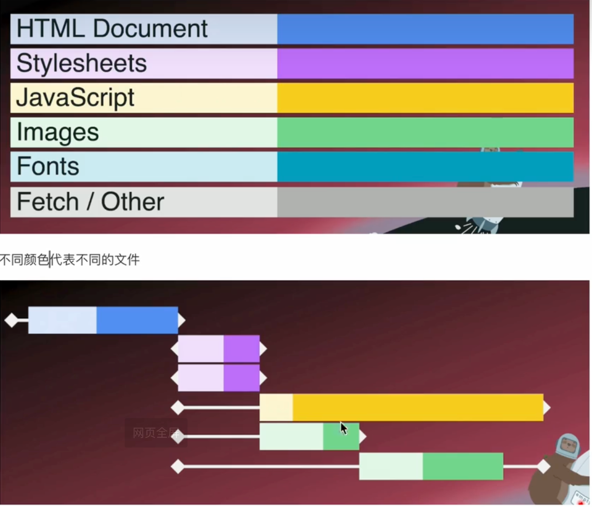
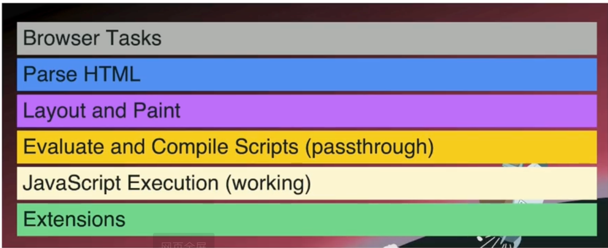
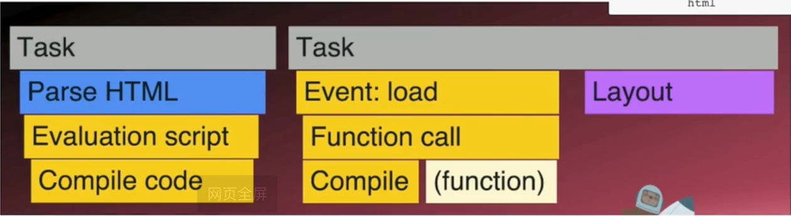

# 浏览器性能优化

## what

- 网站加载、呈现绘制内容和响应的速率
- 来自用户的交互的反应速度和效率

## why

- 用户体验
  - 用户感觉棒的响应是即时的 0.01 秒
  - 用户在 1 秒内体验不间断的流失
  - 用户会在 10 秒内中断并感到沮丧
  - 40%的用户会在 3 秒内离开网站
  - 75%体验过慢速网站的用户不会再访问
- SEO
  - 帮助搜索引擎理解和排名你的网站
- 在线广告
  - 访客越少，买家就越少
  - 来自沃尔玛报告,100 毫秒的改进=最多增加 1%的收入

## how

### 瀑布图

瀑布图是浏览器开发者工具中用来展示网页资源加载时序和耗时的一种图表。每个资源（如 HTML、CSS、JS、图片、字体等）都会以一条水平条形表示，图表从上到下依次显示页面加载各个资源的全过程

| 阶段               | 说明                 |
| ------------------ | -------------------- |
| Queueing           | 等待网络连接         |
| Stalled            | 浏览器等待连接池空闲 |
| DNS Lookup         | 域名解析             |
| Initial Connection | TCP 握手             |
| SSL                | HTTPS 握手           |
| Request Sent       | 请求已发送           |
| Waiting (TTFB)     | 等待响应第一个字节   |
| Content Download   | 正在下载内容         |



### 火焰图 Flame Charts

火焰图主要用于 JavaScript 执行性能分析，展示函数调用栈和它们各自的耗时。它看起来像是“倒置的火焰”，越“高”的表示调用栈越深，越“宽”的表示该函数或栈帧耗时越久。


不同颜色代表不同类型的任务


每一个 Task 会有子级的 Task(也是上下文栈)

```javascript
function task1() {
  task2();
}

function task2() {
  task3();
}

function task3() {
  // do something
}
```


举个例子:

```html
<html>
  <body>
    <script>
      window.addEventListener("load", () => {
        var el = document.createElement("div");
        el.innerHTML = "<h1>Hey</h1>";
        document.body.appendChild(el);
      });
    </script>
  </body>
</html>
```



- 第一个任务解析 HTML,遇到 script 标签,进行预解析代码
- 第二个任务,执行 JS 代码,因为改变了页面,进行 layout
- 火焰图中,每个类型的任务都是按照顺序完成的,js 是单线程的,那么如果一个任务占用了很长时间,就会影响其他的任务比如渲染绘制,那么就会觉得卡顿

### 性能指标

> 这两个现在不适用 SPA 页面

- DOMContentLoaded
  - 页面加载完成，DOM 解析完成，但可能还包含样式、图片等资源未加载完成
- load
  - 页面加载完成，所有资源加载完成

> Core Web Vitals

- how fast your site visibly loads
- how smooth things load
- how quickly users can interact

=>

## LCP largest contentful paint 最大内容绘制

- how fast your site visibly loads the most important element
- what is the "largest"

  - img - Opacity>0 - Size < 100% - low entropy images > 0.05 - 熵(entropy)是什么 - 显示的每个可见像素的位数 - 假设有个图片 3.9MB，以 2800\*1200 尺寸（3360000 像素）显示 每像素大概 9.39 byte
    这会被认为是一个 LCP image - 浏览器中将低熵定义为 **每像素信息量<0.05 位。低熵图片**（如模糊占位符或纯色背景
    图）对用户体验的意义较小，因此它们不会被计入 LCP 的评估中。

  - video
  - CSS:background-image
  - text element

- 衡量
  - <2.5s good
  - \>2.5s <4s needs improvement
  - \>4s poor
- 用户点击后,停止 LCP 的测算

## CLS cumulative layout shift 累计布局偏移

元素加载到页面的流畅性和可预测性如何

- 如何测量 I\*D - (I)影响分数（移动对页面的影响程度） - 在布局过程中受不稳定元素影响的视口部分 转变
   - (D)距离分数（它在视口中移动了多少） - 不稳定元素移动的距离，除以视口的最大维度 （宽度或高度）。
  

- 计算
  - (708 / 768 ) \* (180 / 768) = 0.21
- cumulative
  - 所有受影响的元素的分数总和
- 衡量

  - <0.1 good
  - \>0.1 <0.25 needs improvement
  - \>0.25 poor

## INP interaction to next paint 与下一帧交互

一次交互和下一次浏览器可以绘制之间需要多长时间

> how long does it take between an interaction and the next time the browser can paint

用户互动的速度

> how quickly users can interact

对用户交互的整体响应

> the overall responsiveness to user interactions

包括 click, drag, touch, keypress,不包括 scroll


- Input delay（输入延迟）
  - 用户触发交互后，浏览器不能立即处理事件，因为主线程可能正被其他任务（如执行 JavaScript 或处理布局）占用。
- Processing Time（处理时间）
  - 当主线程空闲后，浏览器开始处理交互事件，包括执行事件监听器中的代码、操作 DOM 等。
- Presentation Delay（呈现延迟）
  - 事件处理完成后，浏览器需要重新计算布局（Layout）和绘制（Paint）页面。

> INP 是衡量每次用户交互发生的时间，挑出最差的一个

- INP is measuring every time the user interaction happens and picking out the worst one
- 4ms 42ms 89ms 7ms **243ms** 9ms 12ms 2ms

- 注意事项
  - 可能没有交互作用
  - 我们可能不知道最坏的情况，直到结束
  - 受设备性能影响 严重
- 衡量
  - <200ms good
  - \>200ms <500ms needs improvement
  - \>500ms poor

## FID First Input Delay 首次输入延迟(已被 INP 取代)

- 2020-2024 (retired and replaced by INP)
- 他仅仅是衡量 Input Delay
- FID 仅衡量网页上*首次*互动的[输入延迟](https://web.dev/articles/optimize-input-delay?hl=zh-cn#what_is_input_delay)。
- INP 通过观察网页上的*所有*互动（从输入延迟开始，到运行事件处理脚本所需的时间，最后到浏览器绘制下一个帧为止）来改进 FID。

**Core Web Vitals 包括 LCP,CLS,INP**

## TTFB (time to first byte)

计算对资源的请求和响应的第一个字节开始到达之间的时间

> how quickly your host responds
>
> measures the time between the request for a resource and when the first byte of a response begins to arrive


- Redirect Time
- Service worker startup time
- DNS lookup time
- TCP connection time
- SSL handshake time
- Request, up until the point at which the first byte of the response has arrived

### **第一阶段：导航与重定向**

```javascript
const navigationPhase = {
  startTime: "页面导航开始时间戳",
  redirectStart: "重定向开始时间",
  redirectEnd: "重定向结束时间",

  // 架构影响
  performance: {
    redirects: "每次重定向增加延迟",
    optimization: "减少重定向跳数，使用HSTS",
  },
};
```

#### **第二阶段：Service Worker 处理**

```javascript
const serviceWorkerPhase = {
  workerStart: "Service Worker启动时间",
  fetchStart: "开始网络请求或缓存查找",

  // 现代PWA架构的关键
  architecture: {
    cacheStrategy: "缓存优先 vs 网络优先",
    performance: "SW可以显著提升重复访问性能",
    tradeoff: "首次启动可能有额外开销",
  },
};
```

#### **第三阶段：网络连接建立**

```javascript
const networkConnectionPhase = {
  domainLookupStart: "DNS查询开始",
  domainLookupEnd: "DNS查询结束",
  connectStart: "TCP连接开始",
  secureConnectionStart: "HTTPS握手开始",
  connectEnd: "连接建立完成",

  // 网络层优化策略
  optimizations: {
    dns: "DNS预解析、DNS over HTTPS",
    connection: "HTTP/2多路复用、连接预热",
    ssl: "TLS 1.3、OCSP stapling",
  },
};
```

#### **第四阶段：请求响应处理**

```javascript
const requestResponsePhase = {
  requestStart: "请求发送开始",
  firstInterimResponseStart: "首次临时响应(如103 Early Hints)",
  responseStart: "响应开始接收",
  responseEnd: "响应接收完成",

  // 服务端性能关键指标
  serverOptimization: {
    ttfb: "Time To First Byte - 服务端处理时间",
    streaming: "流式响应提升感知性能",
    compression: "Gzip/Brotli压缩减少传输时间",
  },
};
```

#### **第五阶段：文档处理与交互**

```javascript
const documentProcessingPhase = {
  // DOM构建阶段
  domInteractive: "DOM构建完成，可以交互",
  domContentLoadedEventStart: "DOMContentLoaded事件开始",
  domContentLoadedEventEnd: "DOMContentLoaded事件结束",
  domComplete: "DOM完全构建完成",

  // 页面加载完成
  loadEventStart: "load事件开始",
  loadEventEnd: "load事件结束",

  // 现代性能架构的关键节点
  criticalRenderingPath: {
    domInteractive: "用户可以开始交互",
    domContentLoaded: "JavaScript可以安全执行",
    loadEvent: "所有资源加载完成",
  },
};
```

#### **第六阶段：卸载处理**

```javascript
const unloadPhase = {
  unloadEventStart: "页面卸载事件开始",
  unloadEventEnd: "页面卸载事件结束",

  // SPA架构中的重要考虑
  spaConsiderations: {
    cleanup: "清理定时器、事件监听器",
    memory: "避免内存泄漏",
    state: "保存应用状态",
  },
};
```

## FCP First Content Paint 首次内容绘制

计算从用户第一次导航到页面的时间到页面内容的任何部分呈现在屏幕上的时间。

> measures the time from when the user first navigated to the page to when any part of the page's content is rendered on the screen

## SI Speed Index - 速度指数

Speed Index 衡量页面内容在视觉上填充的速度，即用户看到页面内容变得"完整"需要多长时间。
计算原理

- 记录页面加载过程中每一帧的视觉完整性
- 计算从开始到视觉完成的时间加权平均值
- 数值越小表示页面视觉填充越快

## TTI Time to Interactive - 可交互时间

TTI 衡量页面从开始加载到完全可交互所需的时间，即用户可以正常点击、输入、滚动等操作的时间点。
计算条件

- 页面被认为"可交互"需要满足：
- 主要内容已加载完成
- 主线程空闲时间 ≥ 50ms
- 事件处理器已绑定
- 用户输入响应时间 < 50ms

## 指标捕获

#### performance API

- 由 **W3C（World Wide Web Consortium）** 提出的标准，旨在提供一组接口，允许开发者获取网页性能数据
- 是现代浏览器的一部分，主要用于测量页面的加载性能、资源加载时间、DOM 操作等关键性能指标
- https://developer.mozilla.org/zh-CN/docs/Web/API/Performance
- 几个重要的属性
  - **timeOrigin** : 返回性能测量开始时的时间的高精度时间戳。
    - `performance.now()` 返回的是从 `timeOrigin` 开始的时间（单位是毫秒，但具有更高的精度）。
    - `performance.timing` 中的时间戳（如 `navigationStart`、`domContentLoadedEventStart` 等）也是相对于 `timeOrigin` 来计算的。
  - **performance.now()**
    - 返回一个高精度的时间戳，表示从 `timeOrigin` 开始到当前时间的时间差（单位是毫秒）。

```javascript
const firstNow = performance.now();
// This loop is just to simulate slow calculations
for (let i = 0; i < 100000; i++) {
  var ii = Math.sqrt(i);
}
const secondNow = performance.now();

// 1.ms Date.now()
// 2.778732348ms performance.now()
const howLongDidOurLoopTake = secondNow - firstNow;
```

- **performance.mark()**
  - 用于创建一个性能测量标记。
  - 可以用于测量页面加载过程中各个阶段的耗时。
- **performance.measure()**

  - 用于测量两个标记之间的时间差。
  - 可以用于测量页面加载过程中各个阶段的耗时。

- **performance.getEntriesByName()**
  - 用于获取特定名称的性能测量数据。
  - 可以用于获取页面加载过程中各个阶段的耗时。

```javascript
performance.mark("beginSquareRootLoop");
// This loop is just to simulate slow calculations
for (let i = 0; i < 1000000; i++) {
  var ii = Math.sqrt(i);
}
performance.mark("endSquareRootLoop");
// Then anywhere in your code you can use

// We create a new entry called measureSquareRootLoop which combines our two marks
performance.measure(
  "measureSquareRootLoop",
  "beginSquareRootLoop",
  "endSquareRootLoop"
);

console.log(performance.getEntriesByName("beginSquareRootLoop"));

console.log(performance.getEntriesByName("measureSquareRootLoop"));
```

- **performance.getEntries()**
  - 用于获取性能测量数据。
  - 可以用于获取页面加载过程中各个阶段的耗时。
- **performance.getEntriesByType()**
  - 用于获取特定类型的性能测量数据。
  - 可以用于获取页面加载过程中各个阶段的耗时。
  - flame: 提供浏览器在一个事件循环中完成的工作量数据 (火焰图)
  - resource: 提供页面加载过程中所有资源（如 CSS、JavaScript、图片等）的性能数据。
  - mark: 开发者可以设置**自定义标记**，用于标记代码执行的特定时间点。
  - Measure:计算两个标记（mark）之间的时间差，帮助开发者测量代码的执行速度。
  - Paint: 与页面绘制有关
  - longtask： 检测运行时间超过 50ms 的任务
- **performance.timing**
  - 提供页面加载过程中各个阶段的耗时。
  - 可以用于获取页面加载过程中各个阶段的耗时。(navigationStart、domInteractive、domContentLoadedEventStart、domContentLoadedEventEnd、domComplete、loadEventStart、loadEventEnd)
- 缺陷

- 需要<span style="color: red;">**手动周期性**</span>的调用, 增加性能开销
- 如果调用不及时, 可能会错过新增的性能数据
- 性能条目有<span style="color: red;">**固定的缓冲区大小**</span>, 当缓冲区满时, 旧的数据会被清除, 导致数据丢失
- 性能数据<span style="color: red;">**存储在全局对象中**</span>, 如果应用程序的多个模块或第三方库都在使用它，管理和过滤数据会变得复杂，可能会引发冲突

#### performanceObserver API

- 基于事件触发，当有新的性能数据生成时，会<span style="color: red;">**自动通知**</span>
- 监听性能数据的生成，可以确保不会错过任何条目，即使性能缓冲区已经被清空
- 可以监听特定类型的数据（如 `resource`、`mark`、`measure`、`paint` 等开发者无需手动从全局数据中筛选，提高了代码可读性和效率
- 不同组件或模块可以单独创建自己的 `PerformanceObserver`，避免多个模块共享全局数据时的冲突
- **基于这个做监控埋点采集数据**

```javascript
const observer = new PerformanceObserver((list) => {
  const entries = list.getEntries();
  entries.forEach((entry) => {
    console.log(entry);
  });
});
observer.observe({ type: "layout-shift", buffered: true });
```

### 分析工具

- Lab Data
  - 模拟用户行为，收集数据
  - 更容易获取,但是数据不是足够的准确
- Field Data
  - 数据流直接从真实用户设备回传给服务器，并通过“报告服务”（Reporting Service）进行数据分析。
  - 这种方式收集的是真实用户在实际使用环境中产生的数据（field 数据）

#### LightHouse

- 是 Lab Data
- 受一定的影响,比如插件,网络等,中间值不是很准确,不能很好地反映出最真实的情况
- 采用 p75 p95 p99 的百分位数来计算, 更准确

#### 浏览器插件 **core web vital extensions **

#### 浏览器插件 ** Chrome User Experience Report (CrUX) **

- field data
- logged in chrome users
- top 1M public websites
- anonymous and public
- 28 day rolling average
- stored google Big Query

> 注册的 Google 用户 28 天以内的数据

https://requestmetrics.com/resources/tools/crux/

#### 其他检测网址

https://pagespeed.web.dev/analysis/https-youtube-com/tzgwoia1fd?form_factor=mobile

https://webpagetest.org

## 如何分析 Chrome DevTools 性能面板

总览图


### 面板结构解析

#### 1. **Frames 帧率区域**

Frames 显示页面的帧率表现：

- **绿色条**: 表示正常帧率 (60FPS)
- **黄色条**: 表示轻微掉帧 (30-60FPS)
- **红色条**: 表示严重掉帧 (<30FPS)
- **高度**: 代表该帧的渲染时间，越高越慢

```javascript
// 帧率计算原理
const targetFrameTime = 16.67; // 60FPS = 1000ms / 60
const frameAnalysis = {
  good: frameTime <= 16.67, // 绿色
  warning: frameTime <= 33.33, // 黄色
  poor: frameTime > 33.33, // 红色
};
```

#### 2. **Network 网络瀑布图**

从上到下按时间顺序展示资源加载：

```javascript
// 网络分析的关键指标
const networkMetrics = {
  // 每个资源的加载阶段
  phases: [
    "Queueing", // 排队等待
    "Stalled", // 连接池等待
    "DNS Lookup", // DNS解析
    "Initial Connection", // TCP握手
    "SSL", // HTTPS握手
    "Request Sent", // 发送请求
    "Waiting (TTFB)", // 等待首字节
    "Content Download", // 下载内容
  ],
};
```

#### 3. **Main Thread 主线程火焰图**

这是性能分析的核心区域：

```javascript
// 主线程任务分类
const mainThreadTasks = {
  scripting: {
    color: "yellow",
    includes: ["Parse HTML", "Evaluate Script", "Compile Script"],
  },
  rendering: {
    color: "purple",
    includes: ["Recalculate Style", "Layout", "Update Layer Tree"],
  },
  painting: {
    color: "green",
    includes: ["Paint", "Composite Layers"],
  },
  system: {
    color: "gray",
    includes: ["GC", "Other"],
  },
  loading: {
    color: "blue",
    includes: ["Parse Stylesheet", "Parse Script"],
  },
};
```

### 分析方法论

#### **第一步：宏观时间线分析**

```javascript
// 关键时间节点识别
const timelineAnalysis = {
  navigationStart: 0,
  firstPaint: "寻找第一个绿色Paint任务",
  domContentLoaded: "寻找DCL标记线",
  loadEvent: "寻找Load标记线",
  userInteraction: "寻找用户输入事件",
};
```

#### **第二步：瓶颈识别**

1. **长任务识别** (>50ms 的黄色块)

```javascript
const longTaskAnalysis = {
  criteria: "duration > 50ms",
  impact: "阻塞主线程，影响响应性",
  solutions: ["Code Splitting", "Web Workers", "Time Slicing", "Lazy Loading"],
};
```

2. **帧率问题定位**

```javascript
const frameDropAnalysis = {
  redFrames: "查找红色帧率条",
  correlateWithTasks: "对应主线程长任务",
  identifyPattern: "是否有周期性掉帧",
};
```

#### **第三步：Thread Pool 线程池理解**

Chrome 的多进程架构：

```javascript
const chromeArchitecture = {
  mainThread: {
    role: "JavaScript执行、DOM操作、样式计算",
    bottleneck: "单线程，容易阻塞",
  },
  compositorThread: {
    role: "合成层处理、滚动、动画",
    advantage: "独立于主线程",
  },
  rasterThread: {
    role: "光栅化处理",
    poolSize: "多线程池",
  },
  ioThread: {
    role: "网络I/O处理",
    characteristic: "异步非阻塞",
  },
};
```

### 实战分析流程

#### **1. 快速诊断**

```javascript
const quickDiagnosis = {
  step1: "查看Frames - 是否有红色掉帧",
  step2: "查看Network - 是否有阻塞资源",
  step3: "查看Main - 是否有长任务",
  step4: "查看Summary - 各类型任务耗时分布",
};
```

#### **2. 深度分析**

```javascript
const deepAnalysis = {
  longTasks: {
    action: "点击长任务块",
    examine: ["调用栈", "源码位置", "耗时分布"],
    optimize: ["函数拆分", "异步处理", "缓存优化"],
  },
  frameDrops: {
    action: "点击红色帧",
    examine: ["Layout Thrashing", "Paint Storm", "Script Blocking"],
    optimize: ["CSS优化", "减少重排重绘", "GPU加速"],
  },
};
```

#### **3. 性能指标关联**

```javascript
const metricsCorrelation = {
  LCP: "在Main Thread中寻找最大内容元素的绘制时间",
  CLS: "观察Layout任务的频率和时机",
  INP: "查看用户交互事件到下一次Paint的间隔",
  TTFB: "在Network中查看第一个HTML资源的Waiting时间",
};
```
