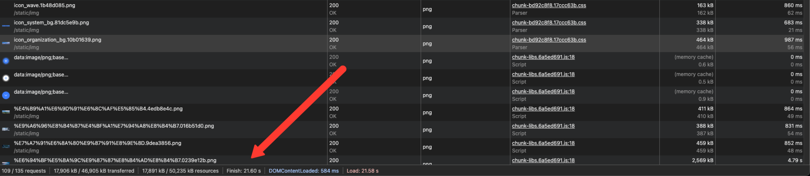

# 浏览器性能优化实战

> 基于我目前的项目的自顶向下的优化实战,从网页加载到构建代码分割逐步优化,也算是对之前几天的理论知识的实践。

## 记录

> 通过 LightHouse，Webpack 插件来记录下当前未优化前的项目的相关数据，以便后续进行对比总结

- LightHouse 测量数据

| 指标 | 您的值 | 状态    | 基准值 |
| ---- | ------ | ------- | ------ |
| TTFB | 22ms   | ✅ 好   | <200ms |
| FCP  | 1.28s  | ⚠️ 一般 | <1.8s  |
| LCP  | 4.68s  | ❌ 差   | <2.5s  |
| SI   | 6.45s  | ❌ 差   | <3.4s  |
| TTI  | 4.8s   | ⚠️ 一般 | <3.8s  |
| CLS  | 0.0046 | ✅ 好   | <0.1   |


- 109 / 150 requests
- 17,906 kB / 47,597 kB transferred
- 17,891 kB / 50,875 kB resources
- Finish: 38.22 s
- DOMContentLoaded: 1.90 s
- Load: 38.12 s
- Webpack 插件数据

  > 当前存在的问题

主要问题（按影响力）

- 图片资源过重（致命，直击 LCP/SI）
  - 未用响应式尺寸（潜在节省 ~9.5 MiB）
  - 未用新一代格式 WebP/AVIF（潜在节省 ~13 MiB）
  - 首屏外图片未懒加载（潜在节省 ~0.9 MiB）
  - LCP 元素耗时 4.68s，明显受大图/加载顺序影响
- 字体与静态资源体积超大
  - 两个 TTF 字体各 ~13MB（极不合理）：应改 WOFF2 + 子集化 + 缓存
  - 总网络负载 ~45.8 MiB（远超常规站点）
- 渲染阻塞资源与未按需加载
  - Render-blocking 预计可节约 ~1s（JS/CSS 阻塞）
  - 未使用/冗余 JS（可精简 ~585 KiB）、未使用 CSS（~69 KiB）
  - libs/elementUI 体积大且有显著未使用比例
- 缓存策略不佳
  - 117 个静态资源未采用高效缓存策略（含大图/字体）
- 结构复杂度
  - DOM 1446（中高），会加重布局与样式计算
- LCP 内容绘制被阻塞

  - 通过立即从 HTML 中发现 LCP 映像并避免延迟加载来优化 LCP
    优先级修复清单（P0→P2）
    > 总结下来就是
    >
    > 1、大量的文件被请求，且很多部分文件没有被用到
    >
    > 2、图片没有被压缩处理，没有选择适合的格式，没有使用现代化的格式，没有使用响应式处理，没有进行懒加载
    >
    > 3、字体资源过大，未使用子集化 + 缓存 + WOFF2
    >
    > 4、libs/elementUI 体积大且有显著未使用比例，JS，CSS 文件很多没有用到
    >
    > 5、缓存策略不佳
    >
    > 6、没有对 LCP 涉及的资源进行高优先级处理
    >
    > 7、没有对资源进行预加载，预获取等等，没有做到按需加载，懒加载
    >
    > 7、没有对资源进行预加载，预获取等等
    >
    > 8、没有做到按需加载，懒加载
    >
    > 9、未启用 HTTP2
    >
    > 10、构建时候分包不彻底，js，css 处理不得当，资源合并不合理

- P0（立刻执行，影响最大）
  - 图片
    - 将首屏/LCP 图与大图统一转换为 WebP/AVIF，压缩至合适质量并提供 2x/1x
    - 所有图片加 `srcset/sizes` 做响应式；首屏外图片统一 `loading=lazy`，`decoding=async`
    - LCP 图：使用 （非 CSS 背景）、设置明确宽高、`fetchpriority=high`、`<link rel=preload>` 指向最终 URL
  - 字体
    - 全量 TTF → 子集化 WOFF2（常见可从 10+MB 降到几十~几百 KB）
    - `font-display: swap`，仅预加载用到的字重，避免多字重全站加载
  - 缓存
    - 哈希化静态资源并设置 `Cache-Control: public, max-age=31536000, immutable`
    - CMS 图片也应走 CDN/长缓存（或至少合理 TTL）
- P1（次优先，显著收益）
  - JS/CSS
    - elementUI 按需引入（Vue2 可用 babel-plugin-component），删除未用组件与样式
    - 拆分 `chunk-libs`，对大依赖做异步分包；移除未用 polyfills/库
    - 移除未使用 CSS（构建期 Purge/CSSTree），提取/内联关键 CSS 减少阻塞
  - 阻塞优化
    - 非关键 JS `defer`/`async`，关键 CSS 仅保留首屏所需，余下按需/懒加载
- P2（中期优化）
  - DOM 优化：控制首屏渲染元素量，延迟非首要模块挂载；复用与合并节点
  - 指标治理：开启 web-vitals v4 软导航埋点，按路由观察 LCP/CLS；针对性的逐页治理
  - 构建与交付：SourceMap 仅保留外网不可见版本；Gzip/Brotli 双栈；Preconnect/Preload 做到最小但精准

定位提示（来自审计 Top）

- 阻塞/冗余
  - JS: chunk-libs(≈488KB，且未用 ~371KB), elementUI(≈189KB，未用 ~143KB), app(≈94KB)
  - CSS: elementUI/lbs CSS 均有未使用
- 大资源
  - 图片：多个 PNG/JPG 单体 0.5~2.5MB+；背景大图与 banner 大图需替换压缩/改格式
  - 字体：PingFang\*.ttf 单体 13MB+（必须替换为子集化 WOFF2）

预期收益

- 替换大图+新格式：首屏带宽和 LCP 大幅下降（LCP 有望 <2.5s）
- 字体子集化：节省 20MB+；首屏阻塞与带宽压力显著下降
- 按需加载/移除未用代码：减少初始 JS/CSS 体积，缩短阻塞与可交互时间
- 强缓存：复访速度提升，带宽成本下降

一句话结论

- 服务器响应很好，性能瓶颈主要在“静态资源过大与加载策略不当”。先“图片与字体”两板斧，再“按需与阻塞优化”，LCP/SI/体量会明显改善。

## 预处理问题

## 图片问题


可以看到有 109 个请求，17M 的大小

### 格式

| 格式   | 简介和特性                                                                                            | 体积示例<br />（基于后文图片 CDN 计算） | 发明年份 | 浏览器兼容性                                                                       |
| ------ | ----------------------------------------------------------------------------------------------------- | --------------------------------------- | -------- | ---------------------------------------------------------------------------------- |
| `jpg`  | - 最常见、应用最广泛的图片格式 <br />- 体积一般，通常小于 png, gif 等格式                             | 158 KB（100%）                          | 1992     | 几乎所有浏览器都支持                                                               |
| `png`  | - 带有透明通道，支持图片部分透明<br />- 体积较大                                                      | 819 KB（518%）                          | 1996     | 几乎所有浏览器都支持                                                               |
| `gif`  | - 支持自动播放的动态图片<br />- 体积较大                                                              | 423 KB（267%）                          | 1989     | 几乎所有浏览器都支持                                                               |
| `svg`  | - 矢量图，任意缩放不影响清晰度<br />- 本质是一种标记语言，可以由浏览器解析渲染<br />- 体积视内容而定  | --                                      | 2001     | Chrome 4 （2010 年 1 月发布）以上版本支持<br />参考资料：https://caniuse.com/svg   |
| `webp` | - 支持动态图片<br />- 压缩率较高：支持有损压缩，无损压缩<br />- 专注于 Web 平台的表现<br />- 体积较小 | 136 KB（86%）                           | 2010     | Chrome 32 （2014 年 1 月发布）以上版本支持<br />参考资料：https://caniuse.com/webp |
| `avif` | - 支持动态图片<br />- 压缩率较高<br />- 体积较小                                                      | 96 KB （60%）                           | 2019     | Chrome 85（2020 年 8 月发布）以上版本支持<br />参考资料：https://caniuse.com/avif  |

- **传统**图片格式：发明于二十年前的`jpg、png、gif、svg`等
- **现代**图片格式：近十年来发明的`webp、avif`等
- 传统格式显著大于现代图片格式。相较于`jpg`格式，`webp`格式的图片一般能减少 10%左右的体积，`avif`格式更是能减少 40%以上的文件体积

### 自适应选择最优图片格式方案：`<picture>`元素

`<picture>`元素允许同时引入多个图片格式的子元素，并<span style='color: red;'>**根据浏览器的兼容性，按先后顺序、自适应加载其中 1 个格式的图片**</span>，实现所有用户根据自身兼容性，获取到最优图片格式。

```html
<picture>
  <source type="image/avif" srcset="https://cdn.com/image.avif" />
  <source type="image/webp" srcset="https://cdn.com/image.webp" />
  
</picture>
```

如果浏览器对所有`<source>`声明的图片格式都不支持，它将降级到加载的``元素`src`属性对应的`jpg`格式图片，作为兜底方案。

> `<picture>`**必须**声明一个`img`子元素，否则如果只有`source`元素，浏览器不会加载`source`的`src`属性对应的图片资源。

也就是说，即使用户的浏览器既不支持解析`avif, webp`格式的图片，甚至不兼容`<picture>`元素，浏览器也会**自动降级**到使用``元素，确保始终有正确的图片加载
如果浏览器对所有`<source>`声明的图片格式都不支持，它将降级到加载的``元素`src`属性对应的`jpg`格式图片，作为兜底方案。

> `<picture>`**必须**声明一个`img`子元素，否则如果只有`source`元素，浏览器不会加载`source`的`src`属性对应的图片资源。

也就是说，即使用户的浏览器既不支持解析`avif, webp`格式的图片，甚至不兼容`<picture>`元素，浏览器也会**自动降级**到使用``元素，确保始终有正确的图片加载

> 注：`<picture>`元素的兼容性：
>
> - Chrome 38+（2014 年发布，晚于支持`webp，avif`格式的版本）
> - Edge 13+（2015 年发布）
> - Safari 9.1+（2016 年发布）
> - IE 不支持，会降级为加载``元素 ˝

#### 格式转换

## 字体问题

- 引入的字体文件太大了，一个文件有 10M 左右，需要优化
- 采用字体子集化的方式进行优化
- Fontmin

- 注意
  - PingFang 无法压缩子集化
  - 该用 woff 格式,将两个文件大小减小的 50%

## JS 问题

## CSS 问题

## 缓存问题

## 渲染问题

## 懒加载问题

## 构建问题

### splitChunks 分包

- 分包前
  - jiaminghi 全局导入
  - avue 全局导入
  - moment 语言包没做处理
  - videojs 全局导入
- 处理后
  - 将 jiaminghi,videojs 按需导入
  - 去掉 avue 包,自己手写
  - moment 去掉去他资源包
  - element 按需导入
- 成果
  - 减少首屏 js 文件大小约 60%

```javascript
new IgnorePlugin({
  resourceRegExp: /^\.\/locale$/,
  contextRegExp: /moment$/,
});
```
