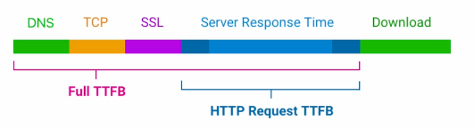
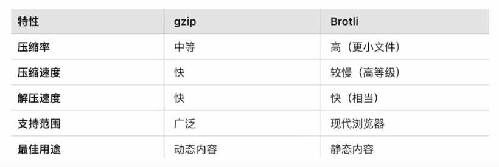

# 浏览器性能优化补充

## 关注你的用户

- 用户设备
- 用户网络
- 地理位置
- 屏幕大小
- 操作系统
- 浏览器

## 确定性能优化目标

- 遵循您的业务指标
  - session time
    - 指用户在一次会话（Session）中停留在网站上的总时长。
      一个会话是用户从进入网站开始到离开网站的整个过程。
  - Bounce Time
    - 跳出时间是用户在仅浏览一个页面后就离开网站的时间，也称为“跳出会话的时长”。
  - 分析数据
    - 比如 CLS INP LCP 这些数据对应的用户行为,是否在差的指标的时候,用户有流失,有跳出(要根据具体的数据分析配合可视化图表来看)
- 对比竞品
  - 有的东西根本没有竞品 用户只能忍受
  - you need to be 20% faster to make users know the difference between you and your competitors.
- SEO PageRank
  - Google 的**PageRank**（网页排名算法）是 Google 搜索引擎最早使用的核心算法之一，它用来衡量网页的重要性，并据此对搜索结果进行排序。
  - 虽然现代的 Google 搜索算法已经融合了更多复杂的因素（例如用户体验、关键词匹配等），PageRank 仍然是基础概念之一。
  - **尽可能的控制 core web vital 指标在 good 范围**

## 投入产出比

- 根据最真实的用户数据 找到最差的指标 用最小的方式来修复他
- 不要花费时间在 投入产出比低的地方,比如一个需要花费大量时间人力的指标,但是修复后带来的收益很低,那么就不值得花费时间去修复

## improving TTFB

### 压缩 HTTP Response

> Accept-Encoding: 客户端告知服务器它支持的压缩编码格式

> Content-Encoding: 服务器告知客户端返回的内容使用了 Brotli (`br`) 压缩格式。客户端需要支持 Brotli 格式才能正确解压和呈现资源

### 压缩方式

- Gzip
  - （1992 年发布）；基于 DEFLATE 算法
- Brotli
  - 现代浏览器支持，但部分老旧环境不支持
  - 由 Google 于 2015 年开发，专为 HTTP 压缩设计。使用一种基于 LZ77 算法改进的技术和更先进的熵编码
  - 对于小文件来说，Brotli 的效率可能不如 gzip
  - 大文件压缩率更高，通常比 Gzip 节省 15-25%体积
  - Brotli 的算法更复杂，它在压缩时需要进行更高计算密度的处理，这对小文件来说显得“得不偿失 ”。例如，压缩一个 1KB 的文件，Brotli 的压缩率提升可能非常有限，但压缩时间却增加了。
    

#### 算法

- LZ77: 基础字典压缩算法，核心思想是查找重复字符串
- Huffman: 熵编码，根据字符频率分配更短的编码
- DEFLATE: 复合算法，包含 LZ77 + Huffman 编码的两阶段压缩
- Brotli 的算法:基于 LZ77 算法改进的技术和更先进的熵编码

## improving LCP

- 消除不必要的资源加载延迟,
  - 确保 LCP 资源得到优先处理,尽可能早的开始加载
- 消除不必要的元素渲染延迟
  - 一旦 LCP 资源加载完成,页面上不应该有任何东西阻止他立即渲染
  - 服务端渲染
- 尽可能的减少 LCP 资源加载时间,且不牺牲质量
  - 优化图像和字体 优化图像格式 webp avif
  - 缓存
  - CDN
- 减少样式文件
  - 以便时间小于 LCP 加载渲染时间
- 减少 TTFB 时间,尽可能快的交付初始 HTML 文档
  - CDN
- https://web.dev/articles/optimize-lcp?hl=zh-cn#optimal_sub-part_times
- https://www.youtube.com/watch?v=fWoI9DXmpdk

- 学到了
- link 标签 fetchpriority="high" resource="preload"
  - https://developer.mozilla.org/zh-CN/docs/Web/HTML/Reference/Elements/link
- img 标签 fetchpriority="high"
- picture 标签 source
  - https://developer.mozilla.org/zh-CN/docs/Web/HTML/Reference/Elements/picture

## improving FCP
