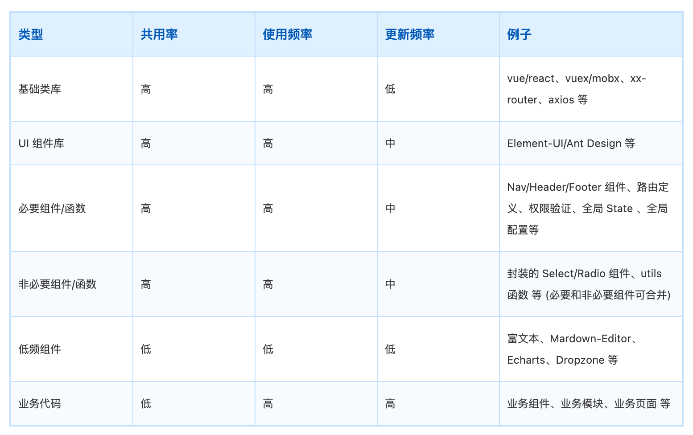

# Webpack 性能优化

## 开发时

- 模块解析优化

- resolve.alias 路径别名，减少解析路径时间，加快构建速度
- resolve.extensions 指定解析包含的文件名，减少解析模块时的尝试次数，优化构建性能
- resolve.modules 明确模块路径，避免递归查找，加速模块解析
- resolve.mainFields 模块入口文件，减少模块查找时间，加快构建速度

- 缓存优化

  - webpack5 开启 cache

```js
module.exports = {
  cache: {
    type: "filesystem",
  },
};
```

- babel-loader 开启 cacheDirectory

```js
module.exports = {
  module: {
    rules: [
      {
        test: /\.js$/,
        use: {
          loader: "babel-loader",
          options: {
            cacheDirectory: true,
          },
        },
      },
    ],
  },
};
```

- cache-loader
  - vuecli 默认集成

```js
module.exports = {
  module: {
    rules: [
      {
        test: /\.js$/,
        use: {
          loader: "cache-loader",
        },
      },
    ],
  },
};
```

- hard-source-webpack-plugin
  - 缓存构建产物，提高构建效率，在 node_modules/.cache/hard-source/v1/目录下
  - 测试二次构建时间提高了 80%

```js
const HardSourceWebpackPlugin = require("hard-source-webpack-plugin");

module.exports = {
  plugins: [new HardSourceWebpackPlugin()],
};
```

### 多线程并行编译

- 利用`Node.js`可以**多进程和线程池**的机制
- 在编译打包时开启多个子进程`child_process`或线程池`worker_thread`分担运算任务，从而提高运算效率，减少构建耗时

- [thread-loader](https://github.com/webpack-contrib/thread-loader)：通过提供`thread-loader`，将耗时较长的指定`loader`的计算任务，分发到包含多个线程（`worker_thread`）的线程池中并行处理，提高运算效率，减少构建耗时。
  - vuecli 默认集成
- [Happypack](https://github.com/amireh/happypack)已经不再维护，5 年没有更新了，是相当陈旧的优化工具，不推荐使用。

### 拆分模块为动态链接

- DllPlugin

```js
// dll.config.js
const { DllPlugin } = require("webpack");
const { DIST_DLL, reactRuntimeName } = require("./constants");

module.exports = {
  mode: "production",
  entry: {
    [reactRuntimeName]: ["vue", "vue-router", "vuex"],
  },
  output: {
    path: DIST_DLL,
    filename: "[name].dll.js",
    library: "[name]_[fullhash]",
  },
  plugins: [
    new DllPlugin({
      // path: path.join(DIST, '../dist/[name]-manifest.json'),
      path: `${DIST_DLL}/[name]-manifest.json`,
      // path: DIST,
      name: "[name]_[fullhash]",
    }),
  ],
};
```

- DllReferencePlugin

```js
// common.config.js
module.exports = {
  plugins: [
    new DllReferencePlugin({
      manifest: require(DIST_DLL + `/${reactRuntimeName}-manifest.json`), // eslint-disable-line
    }),
    // ...
}
```

### 增加编译打包结果缓存

- webpack5 cache
- webpack cache-loader

### 改造项目逻辑

- 首先吧 vue-config.js 文件抽离，模块化处理
- 不然都堆在一起，不好维护

```js
module.exports = {
  publicPath: "/",
  outputDir: "dist",
  assetsDir: "static",
  lintOnSave: process.env.NODE_ENV === "development",
  productionSourceMap: false,
  transpileDependencies: [
    "element-ui",
    "moment",
    "js-md5",
    "js-cookie",
    "qs",
    "path-to-regexp",
    "nprogress",
    "video.js",
    "js-base64",
  ],
  css: require("./build/css.config"),
  devServer: require("./build/devServer.config"),
  configureWebpack: require("./build/configureWebpack.config"),
  chainWebpack: require("./build/chainWebpack.config"),
};
```

### 开发时候使用 esbuild-loader 快速提高构建效率

- esbuild-loader 开发时候使用此 loader 代替 babel-loader，大幅度提高构建效率
- 需要在 vue/cli5 版本中，涉及到版本升级会踩坑

- 只对部分代码进行打包，减少构建工作量

## 构建时

### 压缩

> Gzip 压缩

> js 压缩

- UglifyJsPlugin
- terser-webpack-plugin
  - 在 webpack5 内置，webpack4 版本仍需额外安装

> css 压缩

- css-minimizer-webpack-plugin
  - 把 CSS 从 JS 模块里“抽离成独立 .css 文件”的插件/loader（产出文件）。
  - css-minimizer-webpack-plugin 是使用 cssnano 工具来优化、压缩 CSS（也可以单独使用 ）
- mini-css-extract-plugin
  - 在构建优化阶段对已产出的 CSS 做“压缩/去重/合并”等体积优化（压缩内容）。

> img 压缩

- cwebp 转为 webp 格式，配合 picture/source 适浏览器支持的图片格式
- image-webpack-loader
  - 太影响构建效率，去掉，改成 squoosh-cli+ 全局脚本压缩
- squoosh-cli 配合配合脚本压缩（时间比较慢，但是效果好，不要压缩太多的质量，88%就可以）

> 字体压缩 子集化

> 颗粒度精细分包

- minSize，`maxSize`，`minChunks`，`maxInitialRequests`，`cacheGroups`，priority
- 合理的分包可以提高缓存命中率，以前的 vendor.js 很大，其中一个包变化导致文件指纹变动，需要重新拉取整个 vendor.js，分包后可以避免这个问题
- webpack-bundle-analyzer 分析打包产物找问题
- 处理 moment 语言包过大，配合 IgnorePlugin 排除 locale，手动引入 moment/locale/zh-cn 并 moment.locale('zh-cn')
- Webpack 默认配置有几点值得关注：

  - 区分了`production`和`development`环境，有不同的配置；

  - 指定了`minSize`为，在`production`环境为 20KB，在`development`环境为 10KB，小于这一体积的模块，将不会被分割为新区块，也就不会产生独立构建产物文件。

  - 自带 2 个缓存组：

    - `default`包含所有共同引用大于 2 个区块的模块：`minChunks: 2`
    - `defaultVendors`包含所有来自`/node_modules/`目录的模块：`test: NODE_MODULES_REGEXP`,

有时我们的自定义配置不生效，往往就是因为和这套默认配置有所冲突，需要通过覆盖默认配置，避免冲突。



- 需要注意的是：项目的分包不能一味追求缩减包体积，要注意平衡包颗粒度与 HTTP 请求带来的消耗，针对自身项目多加尝试，找到较为合适的分包方式。
- 分包策略来自https://juejin.cn/post/6844903652956585992

> 修改全局导入

- 按需导入 ，懒加载，从 mainjs 抽离到单个组件配合组件懒加载

> Tree Shaking

- webpack 实现 Tree Shaking 采用了两种不同的方案：

  - **usedExports**：通过标记某些函数是否被使用，之后通过 Terser 来进行优化的

    - 设置 usedExports 为 true 和 false 对比打包后的代码：
      - 在 usedExports 设置为 true 时，会有一段注释：unused harmony export mul
      - 这段注释告知 Terser 在优化时，可以删除掉这段代码

  - **sideEffects**：跳过整个模块/文件，直接查看该文件是否有副作用

```js
// 全部导入 (不支持 tree-shaking)
import _ from "lodash";
// 具名导入(支持 tree-shaking)
import { debounce } from "lodash";
// 直接导入具体的模块 (支持 tree-shaking)
import debounce from "lodash/lib/debounce";
```

> 作用域提升

- 功能是对作用域进行提升，并且让 webpack 打包后的代码更小、运行更快
- 默认情况下 webpack 打包会有很多的函数作用域，包括一些（比如最外层的）IIFE：
- 无论是从最开始的代码运行，还是加载一个模块，都需要执行一系列的函数；
- Scope Hoisting 可以将函数合并到一个模块中来运行
  - 在 production 模式下，默认这个模块就会启用
  - 在 development 模式下，我们需要自己来打开该模块

```js
const webpack = require("webpack");

plugins: [new webpack.optimize.ModuleConcatenationPlugin()];
```

> 配置 sideEffects

> 文件指纹

- hash: Hash 是整个项目的 hash 值，其根据每次编译内容计算得到，每次编译之后都会生成新的 hash,即修改任何文件都会导致所有文件的 hash 发生改变
- chunkhash: 每个 chunk 都有一个 hash
- contenthash: 一个 JS 文件中引入 CSS 文件，编译后它们的 hash 是相同的，而且只要 js 文件发生改变 ，关联的 css 文件 hash 也会改变,这个时候可以使用 mini-css-extract-plugin 里的 contenthash 值，保证即使 css 文件所处的模块里就算其他文件内容改变，只要 css 文件内容不变，那么不会重复构建

> 资源预加载

- prefetch 预加载
- preload 预加载

> 资源懒加载
