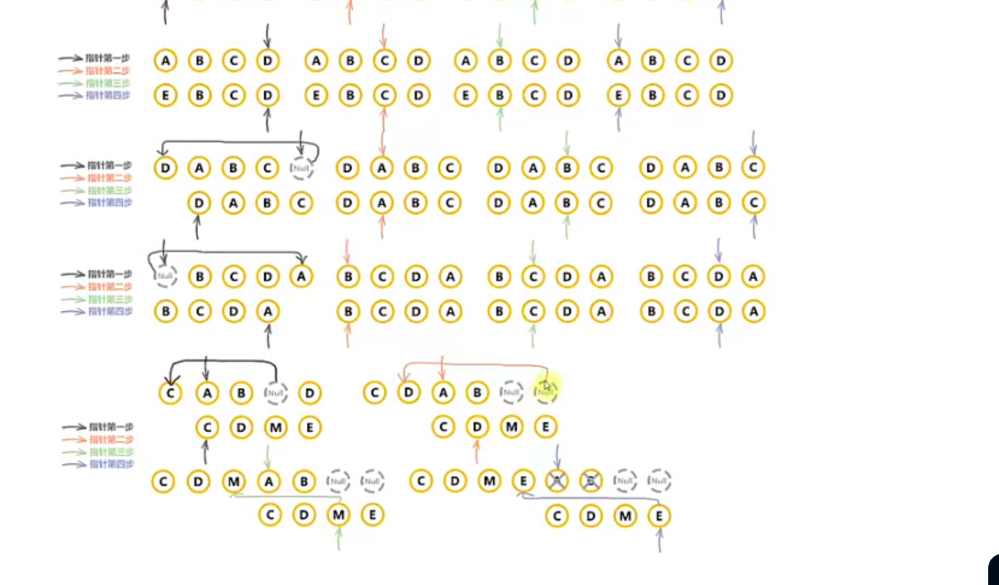

# 虚拟 DOM Diff 算法

## 虚拟 DOM

- 是对真实 DOM 的一种抽象，本质上是个对象，它以最小程度描述了 DOM 的最基本结构，包括节点标签、属性、子节点等

### 为什么需要虚拟 DOM

- 比如我们 createElement 一个标签，这个真实的标签有着非常复杂的属性
  - 1、那如果有过多的标签，我们直接操作这些真实的 DOM 是非常消耗性能的
  - 2、如果我们更新 10 个节点，那么我们就要进行 10 次更新流程，这样是非常消耗性能的
  - 3、diff 在比对时候，如果本体和参照物过于复杂，那么也是消耗性能的，并且比对了很多无用的节点
- 虚拟 DOM 是一种抽象
  - 他可以以最小成本，根据 JS 的运算，得出最优的 DOM 结构
  - 并且不会立即操作 DOM，而是整合多次更新，一次渲染到页面，节省了很多操作
  - 在 diff 时候，虚拟 DOM 比对出最小的差异，并只针对差异部分进行真实 DOM 操作，减少了很多不必要的操作
  - **虚拟 DOM 最重要的是抽象，这种抽象是可以跨平台的，不仅仅局限在浏览器里**

## Diff 算法

- 本质可以理解为对比找不同，对比新旧 DOM 树，以最小的成本完成 DOM 的更新
- 基本策略：同层比较，不跨层；节点类型不同直接替换；同类型再比 props 与 children。

### Vue2

### Vue 2 列表 diff：带 key 的“双端指针 + 四路匹配 + keyMap 兜底”（线性 O(n)）

#### 指针与判等

- 指针：`oldStartIdx/oldEndIdx/newStartIdx/newEndIdx`
- 节点判等 `sameVnode(a,b)`：key 相同 且 标签/注释/输入类型等相同（组件需 Ctor 相同）

#### 四路匹配（4 条快路）

- 头头相等：`sameVnode(old[oldStart], new[newStart])`
  - 动作：`patch`；`oldStart++`；`newStart++`
- 尾尾相等：`sameVnode(old[oldEnd], new[newEnd])`
  - 动作：`patch`；`oldEnd--`；`newEnd--`
- 头尾相等：`sameVnode(old[oldStart], new[newEnd])`（旧头要去新尾）
  - 动作：`patch`；把旧头 DOM 移到旧尾之后（`insertBefore(parent, oldHead.elm, oldTail.elm.nextSibling)`）；`oldStart++`；`newEnd--`
- 尾头相等：`sameVnode(old[oldEnd], new[newStart])`（旧尾要去新头）
  - 动作：`patch`；把旧尾 DOM 移到旧头之前（`insertBefore(parent, oldTail.elm, oldHead.elm)`）；`oldEnd--`；`newStart++`

以上 4 路覆盖“前加/后加/首尾交换”等最常见重排，几乎不需要查表，极快。

#### 兜底：keyMap 定位 + 插入/移动

- 当四路都不命中：
  - 若还没建映射，则对旧中段 `[oldStart..oldEnd]` 建 `oldKey → oldIndex` 映射（一次性）
  - 查 `idxInOld = keyMap.get(new[newStart].key)`
    - 找不到：创建新节点，插在“锚点”前
      - 锚点通常是 `old[oldStart].elm`（即“当前旧头之前”）
    - 找到：
      - 若可复用（`sameVnode`）：
        - `patch(old[idxInOld], new[newStart])`
        - 将旧 DOM 移动到锚点前：`insertBefore(parent, vnodeToMove.elm, old[oldStart].elm)`
        - 把 `old[idxInOld] = undefined` 作为占位（避免后续重复处理，保持区间完整）
      - 否则：当作“找不到”，创建新节点插入
  - `newStart++`

#### 收尾（2 种）

- 旧耗尽（`oldStart > oldEnd`）：挂载剩余新节点到“锚点”前
  - 锚点为“新段尾的下一个兄弟”的真实 DOM：`refElm = new[newEnd+1]?.elm || null`
- 新耗尽（`newStart > newEnd`）：卸载剩余旧节点

#### 为什么是 O(n)

- 主循环每轮至少前进一个端指针或消费一个新节点
- keyMap 构建一次 O(n)，查找 O(1) 均摊
- 移动是 DOM 层面的 `insertBefore`，不重建节点（状态可保留）

#### 伪代码（精简）

```js
while (oldStart <= oldEnd && newStart <= newEnd) {
  if (sameVnode(old[oldStart], new[newStart])) { patch(); oldStart++; newStart++; continue; }
  if (sameVnode(old[oldEnd], new[newEnd]))     { patch(); oldEnd--; newEnd--; continue; }
  if (sameVnode(old[oldStart], new[newEnd]))   { patch(); move(oldHead, after oldTail); oldStart++; newEnd--; continue; }
  if (sameVnode(old[oldEnd], new[newStart]))   { patch(); move(oldTail, before oldHead); oldEnd--; newStart++; continue; }

  // 兜底：keyMap
  keyMap ||= buildKeyToIndex(old, oldStart, oldEnd);
  const idxInOld = keyMap.get(new[newStart].key);
  if (idxInOld == null) {
    createAndInsert(new[newStart], before old[oldStart].elm);
  } else {
    const vnodeToMove = old[idxInOld];
    if (sameVnode(vnodeToMove, new[newStart])) {
      patch(vnodeToMove, new[newStart]);
      old[idxInOld] = undefined; // 占位
      insertBefore(parent, vnodeToMove.elm, old[oldStart].elm);
    } else {
      createAndInsert(new[newStart], before old[oldStart].elm);
    }
  }
  newStart++;
}

if (oldStart > oldEnd) addVnodes(parent, new, newStart, newEnd, refElm = new[newEnd+1]?.elm || null);
else removeVnodes(parent, old, oldStart, oldEnd);
```

#### “锚点”到底是谁？

- 主循环中创建/移动的默认锚点：`old[oldStart].elm`（插在其前）
- 收尾挂载的锚点：`new[newEnd+1]?.elm || null`（插在“新段下一个兄弟”前，null 表示追加到末尾）

#### 走一遍示例（混合四路+兜底）

- 旧：[a, b, c, d]；新：[d, a, b, e]
  - 尾头相等：d==d → patch + 移 d 到 a 前；`oldEnd--`，`newStart++`
  - 头头相等：a==a → patch；`oldStart++`，`newStart++`
  - 兜底：keyMap{ b->1, c->2 }；命中新头 b→idx=1 → patch + 移 b 到锚点 c 前；占位 old[1]=undefined；`newStart++`
  - 兜底：新头 e 不在 map → 创建 e 插在锚点 c 前；`newStart++`
  - 新耗尽？否。旧剩 c → 卸载 c
  - 结果：最少创建 1（e）、最少移动 2（d、b），其余 patch



#### 存在问题

- 在做映射后，比对节点时候，有些东西没有复用

#### 关于 key

- key 的特殊 attribute 主要用在 Vue 的虚拟 DOM 算法，在新旧日 nodes 对比时辨识 VNodes。如果不使用
  key, Vue 会使用一种最大限度减少动态元素并且尽可能的尝试就地修改/复用相同类型元素的算法。
- 当 Vue 正在更新使用 v-for 渲染的元素列表时，它默认使用“就地更新”的策略。如果数据项的顺序被改
  变，vue 将不会移动 DOM 元素来匹配数据项的顺序，而是就地更新每个元素，并且确保它们在每个索引
  位置正确渲染

- vue 在 patch 过程中通过 key 可以判断两个虚拟节点是否是相同节点。(可以复用老节点)
- 无 key 会导致更新的时候出问题
- key 需要是稳定的，不能是索引(索引经常变动)
- 比如在数组头部插入新项，不使用 key 会导致问题：
  - 会就地复用，而不是移动，会导致状态错乱
  - 使用索引也是一样的效果

#### 面试高频要点

- 为什么要把命中的旧位标记为 `undefined`？
  - 作为“洞”占位，保持双端区间，防止重复处理，且在扫描时能被跳过
- 锚点为何是 `old[oldStart].elm`？
  - 使“前插”成为默认操作，可在 O(1) 时间把元素调整到“当前处理窗口”的正确顺序
- 重复/不稳定 key 会怎样？

  - 破坏映射与复用语义，导致移动/复用错误；必须保证 key 稳定唯一（业务 id，勿用索引）

- 小结
  - 先用四路匹配吃掉大部分情况，再用 keyMap 精确定位，最后做收尾挂载/卸载。
  - 全流程只需线性遍历和少量移动，时间 O(n)、空间 O(n)（keyMap）。
