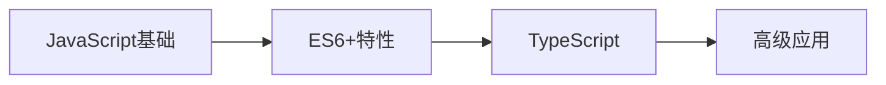

# JavaScript 学习

## 概述

JavaScript是现代前端开发的核心语言，本模块将系统性地学习JavaScript的核心概念、ES6+新特性、TypeScript类型系统等。

## 学习内容

### 基础概念
- **JavaScript原理** - 深入理解JavaScript的执行机制
- **this与原型** - 掌握this指向和原型链机制
- **事件循环** - 理解异步编程的核心机制
- **闭包与作用域** - 掌握函数式编程基础

### ES6+新特性
- **Promise基础** - 异步编程的现代解决方案
- **生成器与迭代器** - 控制函数执行流程
- **Proxy与Reflect** - 元编程能力
- **Symbol与MapSet** - 新的数据类型
- **模块化** - ES6模块系统

### 类型系统
- **TypeScript** - 静态类型检查
- **正则表达式** - 文本处理工具

## 学习路径

## 实践项目

每个概念都配有相应的代码示例和手写实现，建议边学边练。

## 相关资源

- [MDN Web Docs](https://developer.mozilla.org/zh-CN/docs/Web/JavaScript)
- [ECMAScript规范](https://tc39.es/ecma262/)
- [TypeScript官方文档](https://www.typescriptlang.org/docs/) 