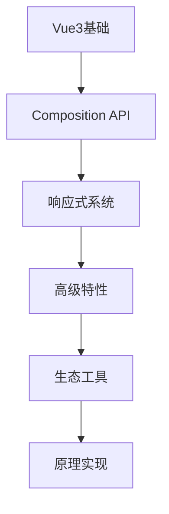

# Vue3 学习

## 概述

Vue3是Vue.js的最新版本，带来了Composition API、更好的TypeScript支持、更小的包体积等重大改进。本模块将深入学习Vue3的使用和原理。

## 学习内容

### 基础用法
- **Vue3基础** - 组件、模板、指令
- **Composition API** - 组合式API的使用
- **响应式系统** - ref、reactive、computed、watch
- **生命周期** - onMounted、onUnmounted等
- **模板语法** - 插值、指令、事件处理

### 核心原理
- **响应式原理** - Proxy、依赖收集、派发更新
- **虚拟DOM** - diff算法、patch过程
- **组件系统** - 组件注册、通信机制
- **编译优化** - 静态提升、Block Tree

### 高级特性
- **Teleport** - 传送门组件
- **Suspense** - 异步组件
- **Fragment** - 多根节点
- **自定义指令** - 指令开发
- **插件系统** - 插件开发

### 生态工具
- **Vue Router** - 路由管理
- **Pinia** - 状态管理
- **Vue DevTools** - 开发工具
- **组件库开发** - 组件库架构

## 核心概念

### Composition API vs Options API
```javascript
// Options API
export default {
  data() {
    return { count: 0 }
  },
  methods: {
    increment() {
      this.count++
    }
  }
}

// Composition API
import { ref } from 'vue'

export default {
  setup() {
    const count = ref(0)
    const increment = () => count.value++
    
    return { count, increment }
  }
}
```

### 响应式系统
```javascript
import { ref, reactive, computed, watch } from 'vue'

// ref - 基本类型
const count = ref(0)

// reactive - 对象类型
const state = reactive({
  name: 'Vue3',
  version: '3.x'
})

// computed - 计算属性
const doubleCount = computed(() => count.value * 2)

// watch - 侦听器
watch(count, (newVal, oldVal) => {
  console.log(`count changed from ${oldVal} to ${newVal}`)
})
```

## 学习路径



## 实践项目

### 组件开发示例
```vue
<template>
  <div class="counter">
    <h2>{{ title }}</h2>
    <p>Count: {{ count }}</p>
    <button @click="increment">+1</button>
    <button @click="decrement">-1</button>
  </div>
</template>

<script setup>
import { ref, computed } from 'vue'

const props = defineProps({
  initialValue: {
    type: Number,
    default: 0
  }
})

const emit = defineEmits(['update'])

const count = ref(props.initialValue)
const title = computed(() => `Counter: ${count.value}`)

const increment = () => {
  count.value++
  emit('update', count.value)
}

const decrement = () => {
  count.value--
  emit('update', count.value)
}
</script>
```

## 学习目标

- 掌握Vue3的基础用法
- 理解Composition API的设计思想
- 深入理解响应式系统原理
- 能够开发Vue3组件库
- 掌握Vue3生态工具的使用

## 相关资源

- [Vue3官方文档](https://cn.vuejs.org/)
- [Vue3源码](https://github.com/vuejs/core)
- [Vue Router](https://router.vuejs.org/)
- [Pinia](https://pinia.vuejs.org/)
- [Vue DevTools](https://devtools.vuejs.org/) 